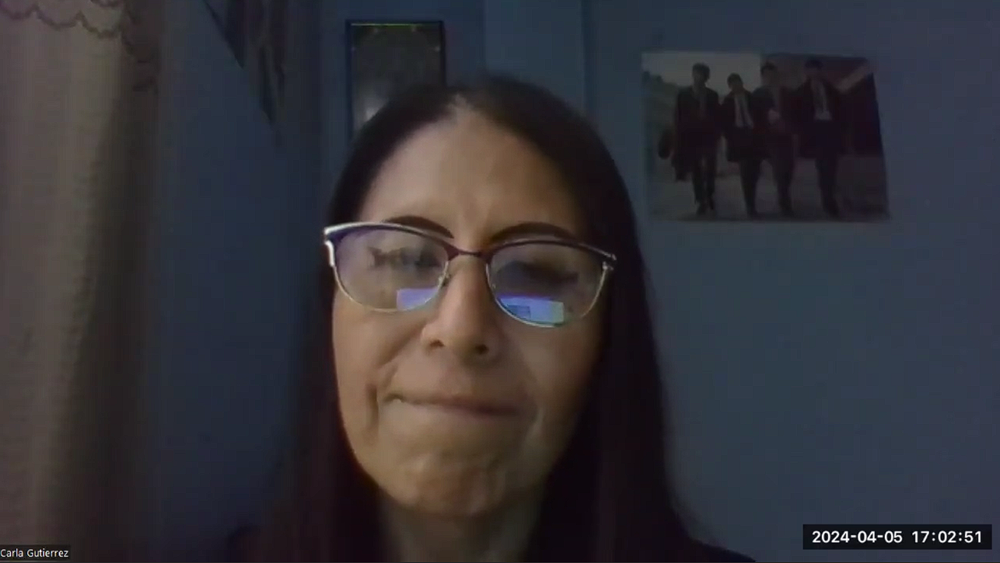

# **Capítulo II:  Requirements Elicitation & Analysis**
## 2.1 Competidores

***Vendty:*** Vendty es una solución de punto de venta y gestión de inventario basada en la nube diseñada para pequeñas y medianas empresas. Con una interfaz intuitiva, Vendty ofrece funcionalidades de venta, gestión de inventarios, y reportes en tiempo real, apoyándose en su capacidad para trabajar tanto online como offline. Ideal para comercios y restaurantes, Vendty facilita la operación diaria y ayuda en la toma de decisiones estratégicas con su análisis de datos.

***Bsale:*** Bsale es un software de ventas originario de Chile que se ha expandido a otros mercados en LATAM. Destaca por su sistema de facturación electrónica y herramientas de gestión de inventarios, enfocándose en mejorar la eficiencia y la experiencia de usuario. Bsale es adaptable, ofreciendo desde sistemas de punto de venta hasta soluciones integrales de e-commerce, lo que lo hace adecuado para una variedad de negocios incluyendo restaurantes, bares y tiendas minoristas.

***Logimov:*** Logimov es una plataforma de software especializada en la gestión de inventarios y almacenes, que se caracteriza por su alto grado de personalización y su capacidad para manejar complejas operaciones logísticas. Es particularmente adecuada para grandes empresas que necesitan control sobre lotes, series y fechas de vencimiento, y se integra bien con sistemas ERP y de cadena de suministro. Logimov es valorado por su robustez y soporte técnico especializado.
## 2.1.1 Análisis Competitivo
<table border="1" style="text-align: center;">
	<tbody>
		<tr>
			<td colspan="6">Competitive Analysis Landscape</td>
		</tr>
		<tr>
			<td colspan="2">¿Por que llevar a cabo este análisis?</td>
			<td colspan="4">Este análisis nos permite identificar las fortalezas y debilidades de competidores como Vendty, Bsale y Logimov, y entender las necesidades de nuestros clientes. Esta información es clave para tomar decisiones estratégicas informadas, desarrollar nuestro producto y estrategias de mercado, y adaptarnos a las tendencias y cambios en la demanda del consumidor.</td>
		</tr>
		<tr>
			<td colspan="2"></td>
			<td>ChefStock </td>
			<td>Vendty</td>
			<td>Bsale </td>
			<td>Logimov </td>
		</tr>
		<tr>
			<td rowspan="2">Perfil</td>
			<td>Overview</td>
			<td>Un software especializado en gestión de inventarios para la industria restaurantera que integra funcionalidades de análisis predictivo y optimización automática de pedidos, proporcionando un sistema inteligente que mejora la eficiencia operativa y la rentabilidad. </td>
			<td>Vendty es un sistema POS y de gestión de inventario conocido por su facilidad de uso y capacidad de operación tanto en línea como fuera de línea, ideal para PYMEs y restaurantes que buscan una integración con e-commerce. </td>
			<td>Bsale es un software chileno que ofrece un sistema de ventas con funcionalidades de POS y facturación electrónica, apuntando a ser una solución eficiente y adaptada a diferentes tamaños de negocios. </td>
			<td>Logimov es una plataforma de gestión de inventarios y almacenes altamente personalizable que soporta la trazabilidad y la logística compleja, ideal para grandes operaciones de restauración y cadenas de suministro. </td>
		</tr>
		<tr>
			<td>Ventaja competitiva ¿Que valor ofrece a los clientes?</td>
			<td>Diseño intuitivo para la industria restaurantera, con funcionalidades en la gestión de inventario en tiempo real. </td>
			<td>Sistema integrado con e-commerce y operación en línea y fuera de línea. </td>
			<td>Facilidad de implementación y cumplimiento de normativas fiscales para la facturación electrónica.</td>
			<td>Alto grado de personalización y capacidad para manejar operaciones logísticas complejas. </td>
		</tr>
		<tr>
			<td rowspan="2">Perfil de Marketing</td>
			<td>Mercado objetivo</td>
			<td>Restaurantes de diferentes tamaños que requieran la gestión de inventario adaptable y escalable. </td>
			<td>PYMEs en el sector restaurantera que buscan una solución POS con gestión de inventario.</td>
			<td>Diversos tipos de comercios, incluidos restaurantes y bares que requieren una gestión eficiente de ventas y stock. </td>
			<td>Grandes cadenas de restauración y empresas con necesidades de gestión de inventario avanzadas.</td>
		</tr>
		<tr>
			<td>Estrategias de marketing</td>
			<td>Estrategias de marketing digital orientadas a la comunidad restaurantera peruana, participación en eventos gastronómicos y colaboración con influencers y chefs reconocidos. </td>
			<td>Publicidad digital, presencia en eventos comerciales y alianzas estratégicas con plataformas de e.-commerce. </td>
			<td>Estrategias de marketing digital orientadas al desempeño y optimización de costos operativos.</td>
			<td>Marketing B2B y colaboraciones con grandes cadenas y proveedores de la industria. </td>
		</tr>
		<tr>
			<td rowspan="3">Perfil de Producto</td>
			<td>Productos &amp; Servicios</td>
			<td>Dispositivos, servicios y software</td>
			<td>Servicios y sistemas integrados</td>
			<td>Dispositivos, servicios y software</td>
			<td>Sistemas y servicios integrados</td>
		</tr>
		<tr>
			<td>Precios &amp; Costos</td>
			<td>Tarifas y precios de acuerdo a las necesidades del cliente</td>
			<td>Tarifas y precios de acuerdo a las necesidades del cliente</td>
			<td>Tarifas y precios de acuerdo a las necesidades del cliente</td>
			<td>Tarifas y precios: desde 10 a 20 dólares.</td>
		</tr>
		<tr>
			<td>Canales de distribución (Web y/o Móvil)</td>
			<td>Disponible en línea a través de la aplicación móvil y la plataforma web.</td>
			<td>Disponible en línea a través de la aplicación móvil y la plataforma web.</td>
			<td>Disponible en línea a través de la aplicación móvil y la plataforma web.</td>
			<td>Disponible en línea a través de la aplicación móvil y la plataforma web.</td>
		</tr>
		<tr>
			<td rowspan="4">Análisis SWOT</td>
			<td>Fortalezas</td>
			<td>
                <ul>
                    <li>Diseñado específicamente para la industria restaurantera peruana, con una profunda comprensión de las necesidades locales.
                    Características avanzadas como análisis predictivo y optimización automática de pedidos, lo cual ofrece un alto valor agregado.
                    Interfaz intuitiva y experiencia de usuario adaptada al contexto cultural y operativo de Perú.</li>
                </ul>
            </td>
			<td>
                <ul>
                    <li>Operación robusta tanto en línea como fuera de línea, lo que proporciona flexibilidad a los negocios.
                        Reconocimiento y establecimiento en el mercado LATAM, con una sólida base de clientes. </li>
                </ul>
            </td>
			<td>
                <ul>
                    <li>Solución integrada de punto de venta con facturación electrónica, lo cual es atractivo para negocios que buscan simplificar operaciones.
                    Flexibilidad y adaptabilidad para negocios de diferentes tamaños y requerimientos. </li>
                </ul>
            </td>
			<td>
                <ul>
                    <li>Alto nivel de personalización y funcionalidades avanzadas para la gestión de almacenes y cadenas de suministro.
                    Adecuado para grandes cadenas de restaurantes con necesidades complejas de inventario. </li>
                </ul>
            </td>
		</tr>
		<tr>
			<td>Debilidades</td>
			<td>
                <ul>
                    <li>Posiblemente menor reconocimiento de marca en comparación con competidores establecidos.

Limitaciones en recursos para marketing y expansión en comparación con grandes empresas internacionales.</li>
                </ul>
            </td>
			<td>
                <ul>
                    <li>Puede que no ofrezca funciones tan especializadas para la industria restaurantera como las de un software dedicado.

La competencia con plataformas internacionales altamente financiadas puede ser intensa.</li>
                </ul>
            </td>
			<td>
                <ul>
                    <li>Puede carecer de características avanzadas de gestión de inventario requeridas por restaurantes grandes o con operaciones complejas. Riesgo de diluir la marca al intentar atender a una amplia gama de tipos de negocios.</li>
                </ul>
            </td>
			<td>
                <ul>
                    <li>Complejidad y posible sobredimensionamiento para pequeños y medianos restaurantes.

Necesidad de inversión en formación y adaptación para el personal del restaurante.</li>
                </ul>
            </td>
		</tr>
		<tr>
			<td>Oportunidades</td>
			<td>
                <ul>
                    <li>Creciente mercado de restaurantes en Perú que buscan digitalizar y optimizar sus operaciones.

Posibilidad de expandir servicios a otras regiones de LATAM con necesidades similares.</li>
                </ul>
            </td>
			<td>
                <ul>
                    <li>Expansión a través de adaptaciones específicas del producto para atender a nichos de mercado dentro del sector restaurantero.</li>
                </ul>
            </td>
			<td>
                <ul>
                    <li>Posibilidad de capturar una mayor cuota de mercado a través de asociaciones estratégicas y mejoras en el producto.</li>
                </ul>
            </td>
			<td>
                <ul>
                    <li>Alianzas con grandes cadenas de restaurantes y proveedores para ofrecer soluciones completas de gestión de inventario.</li>
                </ul>
            </td>
		</tr>
		<tr>
			<td>Amenazas</td>
			<td>
                <ul>
                    <li>Competidores internacionales que entran al mercado peruano con grandes presupuestos de marketing y precios competitivos.

Cambios en las regulaciones fiscales y en la industria restaurantera que requieran adaptaciones rápidas y costosas del software.</li>
                </ul>
            </td>
			<td>
                <ul>
                    <li>Innovación rápida en la industria que puede requerir actualizaciones y mejoras constantes para mantener la competitividad.</li>
                </ul>
            </td>
			<td>
                <ul>
                    <li>Cambios regulatorios en la facturación electrónica que podrían afectar la funcionalidad principal del software.</li>
                </ul>
            </td>
			<td>
                <ul>
                    <li>La necesidad de integración con sistemas de terceros puede complicar su implementación.</li>
                </ul>
            </td>
		</tr>
	</tbody>
</table>

### 2.1.2. Estrategias y tácticas frente a competidores.

- Diferenciación de Producto: 

	* Vamos a destacar las características únicas de nuestro producto que satisfacen necesidades no cubiertas por Vendty, Bsale y Logimov. Esto incluye una mayor personalización para restaurantes específicos y una mejor experiencia de usuario en la gestión de inventarios perecederos. Además, desarrollaremos funcionalidades exclusivas que se anticipen a las tendencias de la industria, como integraciones con sistemas de gestión de pedidos en línea y análisis predictivo para la gestión de suministros.

- Posicionamiento y Marca: 

	* Nos esforzaremos por establecer nuestra marca como líder en innovación dentro del sector restaurantero peruano, destacando nuestra adaptabilidad local y nuestro conocimiento específico del mercado. Utilizaremos testimonios de clientes satisfechos y estudios de caso para construir credibilidad y confianza en nuestro producto.

- Estrategias de Penetración de Mercado: 

	* Ofreceremos promociones iniciales o períodos de prueba para que los nuevos clientes experimenten nuestro producto sin riesgos. Además, implementaremos un programa de referidos para aprovechar el boca a boca en la industria restaurantera, que es muy comunitario.

- Alianzas Estratégicas: 

	* Estableceremos colaboraciones con proveedores de alimentos y bebidas, así como con asociaciones de restaurantes, para ofrecer paquetes conjuntos o descuentos para miembros. También trabajaremos con plataformas de delivery para integrar la gestión de inventarios con la demanda en tiempo real de pedidos.

 

- Comunicación y Marketing: 

	* Implementaremos campañas dirigidas que se enfoquen en las historias de éxito y los puntos de dolor específicos que nuestro producto soluciona. Utilizaremos las redes sociales y colaboraremos con influencers del sector gastronómico para aumentar la visibilidad de nuestra marca y producto.

## 2.2. Entrevistas.

**El diseño de las entrevistas se centró en comprender las necesidades específicas de los gerentes y personal de cocina de restaurantes en relación con la gestión de inventarios. Las preguntas fueron diseñadas para explorar los desafíos actuales, las soluciones existentes y las características deseadas en una plataforma ideal.**

### 2.2.1. Diseño de entrevistas.

### Preguntas de las Entrevistas

### Entrevista para propietarios de restaurantes:

### Objetivo: 
- Comprender las prioridades estratégicas, financieras y operativas de los propietarios en relación con la gestión de inventarios.

### Introducción:

- Saludo y agradecimiento por su participación.

- Breve explicación del propósito de la entrevista, enfatizando cómo su retroalimentación contribuirá a desarrollar una solución que aborde efectivamente los desafíos de la gestión de inventarios en la industria restaurantera.

### Visión General y Estrategia:

- Considerando la relación entre la gestión de inventarios y los resultados de su restaurante, 	¿cómo influye la gestión de inventarios en la rentabilidad y eficiencia operativa de su 	r	estaurante?

- Respecto a sus metas estratégicas, ¿qué cambios o mejoras en la gestión de inventarios 		considera prioritarios para el futuro de su restaurante?

### Decisiones y Evaluaciones:

- Reflexionando sobre sus experiencias con la gestión de inventarios, ¿cuáles son las características que valora más en una herramienta dedicada a esta área?

- ¿Puede identificar algún desafío recurrente en la gestión de su inventario que le gustaría 	que se abordara con una solución tecnológica específica?

### Impacto en la eficiencia operativa:

- Desde su perspectiva, ¿cómo podría una solución integral para la gestión de inventarios 		podría transformar la eficiencia operativa de su restaurante?

- ¿Qué efectos espera que tenga nuestra solución en términos de reducir errores humanos y optimizar los costos relacionados con la gestión de inventarios?

### Interés y Adopción Potencial:

- Basándose en las características y beneficios que hemos discutido, ¿cuán interesado estaría en implementar nuestra solución en su restaurante?

- ¿Qué consideraciones serían decisivas para usted al momento de adoptar una nueva solución de gestión de inventarios?

### Feedback Constructivo:

- Teniendo en cuenta su experiencia y las necesidades de su negocio, ¿hay alguna sugerencia o comentario que le gustaría hacernos para mejorar nuestra solución antes de su lanzamiento?"

- ¿Hay alguna característica o servicio que, si se incluyera en nuestra plataforma, consideraría un verdadero diferenciador frente a otras opciones del mercado?

### Cierre:

- Oportunidad para preguntas finales o comentarios adicionales por parte del entrevistado.

- Agradecimiento sincero por el tiempo y las percepciones compartidas, reiterando el valor de su contribución al desarrollo del proyecto.

* ** **
### Entrevista para el personal de restaurante:

### Objetivo: 
- Comprender los desafíos diarios, las necesidades funcionales y las expectativas del personal de restaurante en relación con la gestión de inventarios, y cómo una aplicación diseñada para optimizar esta área podría mejorar su eficiencia y satisfacción laboral.

### Introducción:

- Saludo y agradecimiento por su participación.

- Breve explicación del propósito de la entrevista.

### Desafíos y Necesidades:

- Desde su perspectiva, ¿cuáles son los mayores desafíos al usar el actual sistema de gestión de inventarios?

- ¿Qué tareas de gestión de inventarios consume más tiempo o resultan ser más problemáticas?

### Características deseadas en la aplicación:

- Considerando su rol y tareas diarias, ¿qué características le gustaría que una aplicación de gestión de inventarios incluyera para hacer su trabajo más fácil o eficiente?

- ¿Hay alguna función que usted cree que podría prevenir los errores comunes que ocurren durante el proceso de gestión de inventarios? ¿Cómo podría mejorarse esto?

### Mejora en la Eficiencia y la comunicación:

- ¿Cómo cree que una aplicación que proporciona seguimiento detallado y 	en tiempo real del inventario afectaría su trabajo diario?

- En términos de comunicación dentro del equipo, ¿cómo podría una solución tecnológica mejorar la forma en que usted y sus colegas gestionan y comparten información sobre el inventario?

### Capacitación y Facilidad de Uso:

- ¿Qué tan importante es para usted la facilidad de uso y una curva de aprendizaje suave al introducir una nueva herramienta tecnológica en su trabajo?

- Si se implementa una nueva aplicación de gestión de inventarios, ¿qué tipo de capacitación o recursos encontraría más útiles para familiarizarse con ella?

### Feedback y Sugerencias:

- Basado en su experiencia, ¿hay algo específico que le gustaría que se abordara o incluyera en una aplicación de gestión de inventarios para que realmente se ajuste a sus necesidades?

- ¿Hay alguna preocupación o sugerencia que tenga respecto a la implementación de una solución tecnológica para la gestión de inventarios en su lugar de trabajo?

### Cierre:

- Preguntas finales y agradecimiento por su tiempo
***

### 2.2.2. Registro de entrevistas.

Video de entrevistas: https://upcedupe-my.sharepoint.com/:v:/g/personal/u201910146_upc_edu_pe/Ef95TOQU_RxKurrgB55QiDEBqG69gpQObw_nyiUjvsmwyg?e=ql0dea&nav=eyJyZWZlcnJhbEluZm8iOnsicmVmZXJyYWxBcHAiOiJTdHJlYW1XZWJBcHAiLCJyZWZlcnJhbFZpZXciOiJTaGFyZURpYWxvZy1MaW5rIiwicmVmZXJyYWxBcHBQbGF0Zm9ybSI6IldlYiIsInJlZmVycmFsTW9kZSI6InZpZXcifX0%3D

* **Primera Entrevista: Personal de restaurante**

Datos Demográficos: 

- **Nombre:** Carla Gutiérrez.
- **Edad:** 41.
- **Distrito:** San Miguel.
- **Ocupación:** Personal del restaurante.

Duración de la entrevista: 11:09 minutos.

* **Resumen:** Carla Gutiérrez, personal de un restaurante, nos comenta su opinión en lo que respecta a la gestión de inventarios. Nos cuenta acerca de la dificultad para mantener actualizada la información de inventario, especialmente en momentos de alta demanda o fluctuaciones en los suministros, así como el largo tiempo que le toma hacer la realización de conteos físicos periódicos para verificar el inventario. Cree que una aplicación de seguimiento permitiría una visión más clara y precisa del inventario disponible, lo que facilitaría la planificación de pedidos, la gestión de stock y la colaboración al permitir compartir información actualizada sobre inventario entre diferentes departamentos o turnos de trabajo. Finalmente, le gustaría ver incluido algunos recordatorios o alarmas para fechas de caducidad de productos, así como herramientas para analizar tendencias de ventas y pronosticar la demanda futura.

***
* **Segunda Entrevista: Propietario de restaurante**

Datos Demográficos: 

* **Nombre:** Pedro Nanfuñay.
* **Edad:** 21.
* **Distrito:** La Perla.
* **Ocupación:** Propietario de Restaurante.

Duración de la entrevista: 4:39 minutos.
  
* **Resumen:** Pedro Nanfuñay, propietario de un restaurante, proporcionó una visión profunda sobre la gestión de inventarios en su establecimiento. Destacó la importancia crítica de una gestión efectiva para controlar costos, evitar desperdicios y garantizar un flujo operativo eficiente. Identificó la necesidad de mejorar la eficiencia a través de herramientas tecnológicas que faciliten el seguimiento del inventario y la predicción de necesidades futuras. En particular, resaltó el desafío de rastrear fechas de vencimiento y expresó interés en soluciones que automatizaran estas tareas. Pedro mostró disposición para explorar soluciones tecnológicas que se adapten a las necesidades específicas de su restaurante, priorizando la facilidad de uso, la integración con sistemas existentes y el costo. Proporcionó feedback constructivo, enfatizando la importancia de la intuitividad y la capacidad de prever necesidades de inventario como características diferenciales clave. En general, su participación ofreció valiosas percepciones para el desarrollo exitoso de nuestra solución de gestión de inventarios en la industria restaurantera.
-----

* **Tercera Entrevista: Personal del restaurante**

Datos Demográficos: 

- **Nombres:** Rosa Cuadros.
- **Edad:** 22 años.
- **Distrito:** Chorrillos.
- **Ocupación: Personal de restaurante.**

Duración de la entrevista: 11:42 minutos. 

* **Resumen:** La entrevista realizada se aborda las dificultades y necesidades de gestión de inventarios en un restaurante. La persona entrevistada, Rosa Cuadros, señala problemas con la complejidad de la interfaz del sistema actual y su dificultad de integración, lo que genera inexactitudes en los informes y actualizaciones de inventario. Asimismo, destaca la tarea problemática de ingresar datos manualmente, lo que a menudo lleva a errores debido a la confusión y sobrecarga de trabajo. Por otro lado, expresa la necesidad de características que simplifiquen la entrada de datos, como el escaneo de productos, y una mejor integración con otros sistemas. Además, sugiere la implementación de verificaciones de datos en tiempo real para prevenir errores comunes y enfatiza la importancia de un software fácil de usar con alertas automáticas para mejorar la comunicación y la eficiencia operativa. Rosa también recomienda capacitaciones y soporte técnico para facilitar la adopción del software, asimismo, mejorar la gestión diaria y estratégica del inventario.

### 2.2.3. Análisis de entrevistas.

|                                                       Segmento Objetivo 1 Propietarios de Restaurantes                                                        |                                                                                               Segmento Objetivo 2 Personal de Restaurantes                                                                                                |
|:-----------------------------------------------------------------------------------------------------------------------------------------------------------------:|:---------------------------------------------------------------------------------------------------------------------------------------------------------------------------------------------------------------------------------------------:|
|Pedro destaca la importancia crítica de una gestión efectiva de inventarios para controlar costos y garantizar un flujo operativo sin problemas en su restaurante. |                                               Rosa destaca la tarea problemática de ingresar datos manualmente, lo que a menudo lleva a errores debido a la confusión y sobrecarga de trabajo.                                                |
|Pedro identifica la necesidad de una solución tecnológica que simplifique el seguimiento de inventario y la predicción de necesidades futuras, mientras destaca la importancia de la facilidad de uso y la personalización.| Rosa sugiere la implementación de verificaciones de datos en tiempo real para prevenir errores comunes y enfatiza la importancia de un software fácil de usar con alertas automáticas para mejorar la comunicación y la eficiencia operativa. |
|Pedro muestra un fuerte interés en adoptar soluciones tecnológicas que se adapten a las necesidades específicas de su restaurante, enfatizando la importancia de la intuitividad y la capacidad de prever necesidades de inventario como características clave.|                                      Rosa también recomienda capacitaciones y soporte técnico para facilitar la adopción del software, asimismo, mejorar la gestión diaria y estratégica del inventario.                                      |
||Carla nota la dificultad para mantener actualizada la información de inventario, así como lo mucho que le toma hacer la realización de conteos físicos periódicos de verificación. |
||Carla cree que una aplicación de gestión permitiría una visión más clara y precisa del inventario disponible, lo que facilitaría la planificación de pedidos, la gestión de stock y la colaboración entre trabajadores.|
||Carla piensa que algunas funciones útiles pueden ser el implementar recordatorios o alarmas para fechas de caducidad de productos y herramientas para analizar tendencias de ventas y pronosticar la demanda futura. |

## 2.3. Needfinding
En esta sección se explica y presenta los artefactos resultantes del proceso de análisis de la información recolectada.
### 2.3.1. User Personas.
**User Persona 1 (Propietarios de Restaurantes)**

**User Persona 2 (Personal de Restaurantes)**

### 2.3.2. User Task Matrix.

Los User Task Matrix nos ayudará a identificar las actividades realizadas por nuestro segmento objetivo y evaluar su importancia.

Indicadores de importancia:

| ALTA | MEDIA | BAJA |
|------|------|-------|      

Indicadores de frecuencia:

| SIEMPRE | RARA VEZ | NUNCA |
|------|------|-------|   

Los segmentos considerados para esta matriz son: 

**Segmento Objetivo 1**: Propietarios de Restaurantes. 

**Segmento Objetivo 2**: Personal de Restaurantes. 

|  Tarea  | SO1   |   | SO2  |   |
| ------------ | ------------ | ------------ | ------------ | ------------ |
|   |  Frecuencia  |  Importancia  |  Frecuencia | Importancia  |
|Realizar inventario    |  Siempre  |  Alta  |   Siempre | Alta   |
|  Verificar fechas de vencimiento  |  Siempre  |  Alta  | Rara vez   |  Alta  |
|  Mantener actualizada la información del inventario  |  Siempre  |  Alta  |  Siempre  | Alta   |
| Comunicar actualizaciones de inventario   |  Rara vez |  Baja |   Siempre    | Alta   |
|Gestionar pedidos    |  Siempre  |Alta   |  Rara vez  | Alta   |
| Pronosticar la demanda futura   |   Siempre    |Alta    |  Rara vez  |  Media   |
### 2.3.3. User Journey Mapping

En este punto se llevó a cabo el User Journey Mapping. El flujo comienza cuando el usuario accede al sitio web para consultar el panel de control, realizar búsquedas, actualizar y agregar productos, así como imprimir informes diarios. Esta secuencia nos proporciona insights sobre las acciones del usuario, los procesos implicados, los desafíos que enfrenta, su experiencia y las oportunidades de mejora identificadas.

**User Journey Mapping – SO1** 

### 2.3.4. Empathy Mapping.
**Empathy Mapping – SO1**

- En este Empathy Map, nos centramos en comprender las necesidades, preocupaciones, y emociones de Pedro Nanfuñay		

**Empathy Mapping – SO2**

- En este Empathy Map, nos centraremos en comprender las necesidades, preocupaciones, y emociones de Carla Gutiérrez.	

### 2.3.5 As-Is Scenario Mapping
**As-is Scenario Mapping – SO1** 

**As-is Scenario Mapping – SO2** 

### 2.4. Ubiquitous Language.
| Término             | Significado                                                                                     |
|---------------------|-------------------------------------------------------------------------------------------------|
| **Inventory Management** | Proceso de supervisión y control de los artículos y suministros necesarios para las operaciones del restaurante, incluido el seguimiento, pedido y organización del inventario. |
| **Subscription Plan**   | Modelo de precios donde los clientes pagan una tarifa recurrente en intervalos regulares para acceder a un producto o servicio.                              |
| **Onboarding**          | Proceso de familiarización de nuevos usuarios con una plataforma o servicio, que normalmente implica configuración, capacitación y uso inicial.             |
| **Dashboard**           | Interfaz visual que proporciona a los usuarios un resumen de información importante y métricas clave.                                                    |
| **Inventory Tracking**  | Monitoreo y registro del movimiento de artículos dentro y fuera del inventario, generalmente en tiempo real.                                              |
| **Referral Program**    | Estrategia de marketing donde los clientes existentes reciben incentivos para referir nuevos clientes a un negocio.   

