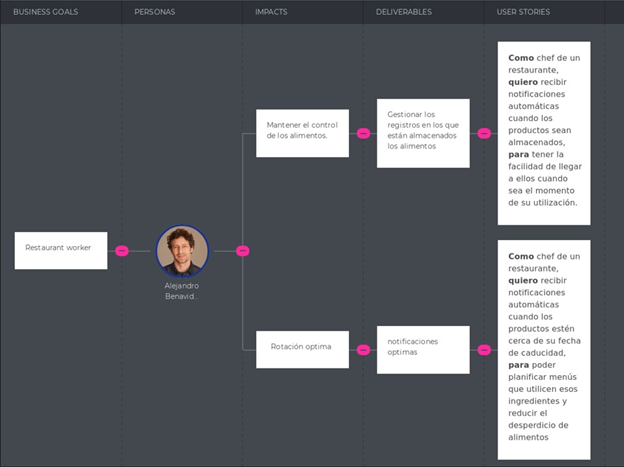

# Capítulo III: Requirements Specification
## **3.1. To-Be Scenario Mapping.**

# **3.2 User Stories**
<table>
    <thead>
        <tr>
            <th>Épica</th>
            <th>Creación de la Landing Page</th>
        </tr>
    </thead>
    <tbody>
        <tr>
            <td>ID-HU</td>
            <td>01</td>
            <td>Owner</td>
            <td>01</td>
        </tr>
        <tr>
            <td>Título HU</td>
            <td colspan="3">Barra de navegación clara</td>
        </tr>
        <tr>
            <td>Puntos de estimación</td>
            <td>3</td>
            <td>Sprint</td>
            <td>1</td>
        </tr>
        <tr>
            <td>Descripción HU</td>
            <td colspan="3">Como usuario, quiero una barra de navegación clara en la Landing Page para poder acceder fácilmente a diferentes secciones del sitio.</td>
        </tr>
        <tr>
            <td>Criterios de Aceptación</td>
            <td colspan="3">
                
Escenario 01: Navegación intuitiva

                
Dado que estoy en la Landing Page Y quiero acceder a diferentes secciones del sitio Cuando haga clic en un enlace de la barra de navegación Entonces seré redirigido a la sección correspondiente del sitio.

                
Escenario 02: Acceso desde dispositivos móviles

                
Dado que estoy navegando en la Landing Page desde un dispositivo móvil Y quiero acceder a diferentes secciones del sitio Cuando toque en un enlace de la barra de navegación Entonces seré redirigido a la sección correspondiente del sitio.

            </td>
        </tr>
    </tbody>
</table>

<table>
    <thead>
        <tr>
            <th>Épica</th>
            <th>Creación de la Landing Page</th>
        </tr>
    </thead>
    <tbody>
        <tr>
            <td>ID-HU</td>
            <td>02</td>
            <td>Owner</td>
            <td></td>
        </tr>
        <tr>
            <td>Título HU</td>
            <td colspan="3">Visualizar la sección "Quiénes Somos?"</td>
        </tr>
        <tr>
            <td>Puntos de Estimación</td>
            <td>3</td>
            <td>Sprint</td>
            <td>1</td>
        </tr>
        <tr>
            <td>Descripción HU</td>
            <td colspan="3">¿Como usuario, quiero una sección "Quiénes Somos?" en la Landing Page para conocer más sobre la empresa.</td>
        </tr>
        <tr>
            <td>Criterios de Aceptación</td>
            <td colspan="3">
                
Escenario 01: Visualización de información

                
Dado que estoy en la Landing Page Y quiero conocer más sobre la empresa Cuando navegue por la sección "Quiénes Somos?" Entonces podré ver información detallada sobre la historia, misión y valores de la empresa.

                
Escenario 02: Acceso rápido desde el menú principal

                
Dado que estoy en cualquier sección de la Landing Page Y quiero acceder rápidamente a la sección "Quiénes Somos?" Cuando haga clic en el enlace correspondiente del menú principal Entonces seré llevado directamente a la sección de "Quiénes Somos?".

            </td>
        </tr>
    </tbody>
</table>

<table>
    <thead>
        <tr>
            <th>Épica</th>
            <th>Creación de la Landing Page</th>
        </tr>
    </thead>
    <tbody>
        <tr>
            <td>ID-HU</td>
            <td>03</td>
            <td>Owner</td>
            <td></td>
        </tr>
        <tr>
            <td>Título HU</td>
            <td colspan="3">Desarrollar el diseño de la sección "Servicios” </td>
        </tr>
        <tr>
            <td>Puntos de Estimación</td>
            <td>4</td>
            <td>Sprint</td>
            <td>1</td>
        </tr>
        <tr>
            <td>Descripción HU</td>
            <td colspan="3">Como usuario, quiero una sección "Servicios" en la Landing Page para conocer los servicios ofrecidos por la empresa.</td>
        </tr>
        <tr>
            <td>Criterios de Aceptación</td>
            <td colspan="3">
                
Escenario 01: Navegación intuitiva

                
Dado que estoy en la Landing Page Y quiero conocer los servicios ofrecidos por la empresa Cuando navegue por la sección "Servicios" Entonces podré ver una lista de servicios con descripciones detalladas y posibles paquetes o planes disponibles.

                
Escenario 02: Acceso desde el menú principal

                
Dado que estoy en cualquier sección de la Landing Page Y quiero acceder rápidamente a la sección "Equipo de Trabajo" Cuando haga clic en el enlace correspondiente del menú principal Entonces seré llevado directamente a la sección de "Equipo de Trabajo".

            </td>
        </tr>
    </tbody>
</table>

<table>
    <thead>
        <tr>
            <th>Épica</th>
            <th>Creación de la Landing Page</th>
        </tr>
    </thead>
    <tbody>
        <tr>
            <td>ID-HU</td>
            <td>04</td>
            <td>Owner</td>
            <td></td>
        </tr>
        <tr>
            <td>Título HU</td>
            <td colspan="3">Visualizar información sobre el Sección Equipo de Trabajo</td>
        </tr>
        <tr>
            <td>Puntos de Estimación</td>
            <td>5</td>
            <td>Sprint</td>
            <td>1</td>
        </tr>
        <tr>
            <td>Descripción HU</td>
            <td colspan="3">Como usuario, quiero una sección "Equipo de Trabajo" en la Landing Page para conocer al equipo detrás de la empresa.</td>
        </tr>
        <tr>
            <td>Criterios de Aceptación</td>
            <td colspan="3">
                
Escenario 01: Visualización del equipo

                
Dado que estoy en la Landing Page Y quiero conocer al equipo de trabajo de la empresa Cuando navegue por la sección "Equipo de Trabajo" Entonces podré ver una lista de miembros del equipo con sus fotos, roles y una breve descripción de sus responsabilidades y experiencia.

            </td>
        </tr>
    </tbody>
</table>

# **3.3 IMPACT MAPPING**

# **3.4 PRODUCT BACKLOG**

**Product Backlog:**
