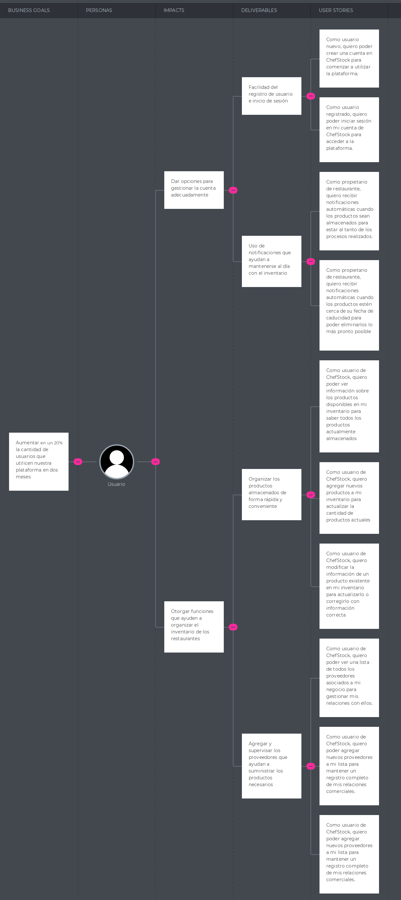

# Capítulo III: Requirements Specification
## **3.1. To-Be Scenario Mapping.**

# **3.2 User Stories**
<table>
    <thead>
        <tr>
            <th>Épica</th>
            <th>Creación de la Landing Page</th>
        </tr>
    </thead>
    <tbody>
        <tr>
            <td>ID-HU</td>
            <td>01</td>
            <td>Owner</td>
            <td>01</td>
        </tr>
        <tr>
            <td>Título HU</td>
            <td colspan="3">Barra de navegación clara</td>
        </tr>
        <tr>
            <td>Puntos de estimación</td>
            <td>3</td>
            <td>Sprint</td>
            <td>1</td>
        </tr>
        <tr>
            <td>Descripción HU</td>
            <td colspan="3">Como usuario, quiero una barra de navegación clara en la Landing Page para poder acceder fácilmente a diferentes secciones del sitio.</td>
        </tr>
        <tr>
            <td>Criterios de Aceptación</td>
            <td colspan="3">
                
Escenario 01: Navegación intuitiva

                
Dado que estoy en la Landing Page Y quiero acceder a diferentes secciones del sitio Cuando haga clic en un enlace de la barra de navegación Entonces seré redirigido a la sección correspondiente del sitio.

                
Escenario 02: Acceso desde dispositivos móviles

                
Dado que estoy navegando en la Landing Page desde un dispositivo móvil Y quiero acceder a diferentes secciones del sitio Cuando toque en un enlace de la barra de navegación Entonces seré redirigido a la sección correspondiente del sitio.

            </td>
        </tr>
    </tbody>
</table>

<table>
    <thead>
        <tr>
            <th>Épica</th>
            <th>Creación de la Landing Page</th>
        </tr>
    </thead>
    <tbody>
        <tr>
            <td>ID-HU</td>
            <td>02</td>
            <td>Owner</td>
            <td></td>
        </tr>
        <tr>
            <td>Título HU</td>
            <td colspan="3">Visualizar la sección "Quiénes Somos?"</td>
        </tr>
        <tr>
            <td>Puntos de Estimación</td>
            <td>3</td>
            <td>Sprint</td>
            <td>1</td>
        </tr>
        <tr>
            <td>Descripción HU</td>
            <td colspan="3">¿Como usuario, quiero una sección "Quiénes Somos?" en la Landing Page para conocer más sobre la empresa.</td>
        </tr>
        <tr>
            <td>Criterios de Aceptación</td>
            <td colspan="3">
                
Escenario 01: Visualización de información

                
Dado que estoy en la Landing Page Y quiero conocer más sobre la empresa Cuando navegue por la sección "Quiénes Somos?" Entonces podré ver información detallada sobre la historia, misión y valores de la empresa.

                
Escenario 02: Acceso rápido desde el menú principal

                
Dado que estoy en cualquier sección de la Landing Page Y quiero acceder rápidamente a la sección "Quiénes Somos?" Cuando haga clic en el enlace correspondiente del menú principal Entonces seré llevado directamente a la sección de "Quiénes Somos?".

            </td>
        </tr>
    </tbody>
</table>

<table>
    <thead>
        <tr>
            <th>Épica</th>
            <th>Creación de la Landing Page</th>
        </tr>
    </thead>
    <tbody>
        <tr>
            <td>ID-HU</td>
            <td>03</td>
            <td>Owner</td>
            <td></td>
        </tr>
        <tr>
            <td>Título HU</td>
            <td colspan="3">Desarrollar el diseño de la sección "Servicios” </td>
        </tr>
        <tr>
            <td>Puntos de Estimación</td>
            <td>5</td>
            <td>Sprint</td>
            <td>1</td>
        </tr>
        <tr>
            <td>Descripción HU</td>
            <td colspan="3">Como usuario, quiero una sección "Servicios" en la Landing Page para conocer los servicios ofrecidos por la empresa.</td>
        </tr>
        <tr>
            <td>Criterios de Aceptación</td>
            <td colspan="3">
                
Escenario 01: Navegación intuitiva

                
Dado que estoy en la Landing Page Y quiero conocer los servicios ofrecidos por la empresa Cuando navegue por la sección "Servicios" Entonces podré ver una lista de servicios con descripciones detalladas y posibles paquetes o planes disponibles.

                
Escenario 02: Acceso desde el menú principal

                
Dado que estoy en cualquier sección de la Landing Page Y quiero acceder rápidamente a la sección "Equipo de Trabajo" Cuando haga clic en el enlace correspondiente del menú principal Entonces seré llevado directamente a la sección de "Equipo de Trabajo".

            </td>
        </tr>
    </tbody>
</table>

<table>
    <thead>
        <tr>
            <th>Épica</th>
            <th>Creación de la Landing Page</th>
        </tr>
    </thead>
    <tbody>
        <tr>
            <td>ID-HU</td>
            <td>04</td>
            <td>Owner</td>
            <td></td>
        </tr>
        <tr>
            <td>Título HU</td>
            <td colspan="3">Visualizar información sobre el Sección Equipo de Trabajo</td>
        </tr>
        <tr>
            <td>Puntos de Estimación</td>
            <td>2</td>
            <td>Sprint</td>
            <td>1</td>
        </tr>
        <tr>
            <td>Descripción HU</td>
            <td colspan="3">Como usuario, quiero una sección "Equipo de Trabajo" en la Landing Page para conocer al equipo detrás de la empresa.</td>
        </tr>
        <tr>
            <td>Criterios de Aceptación</td>
            <td colspan="3">
                
Escenario 01: Visualización del equipo

                
Dado que estoy en la Landing Page Y quiero conocer al equipo de trabajo de la empresa Cuando navegue por la sección "Equipo de Trabajo" Entonces podré ver una lista de miembros del equipo con sus fotos, roles y una breve descripción de sus responsabilidades y experiencia.

            </td>
        </tr>
    </tbody>
</table>

<table>
    <thead>
        <tr>
            <th>Épica</th>
            <th>Gestion de cuenta del usuario </th>
        </tr>
    </thead>
    <tbody>
        <tr>
            <td>ID-HU</td>
            <td>05</td>
            <td>Owner</td>
            <td></td>
        </tr>
        <tr>
            <td>Título HU</td>
            <td colspan="3">Crear nueva cuenta </td>
        </tr>
        <tr>
            <td>Puntos de Estimación</td>
            <td>5</td>
            <td>Sprint</td>
            <td>2</td>
        </tr>
        <tr>
            <td>Descripción HU</td>
            <td colspan="3">Como usuario nuevo, quiero poder crear una cuenta en ChefStock para comenzar a utilizar la plataforma.</td>
        </tr>
        <tr>
            <td>Criterios de Aceptación</td>
            <td colspan="3">
                
Escenario 1: Registro exitoso 

                
Dado que estoy en la página de inicio de ChefStock, Cuando hago clic en "Registrar" Y completo un formulario de registro con mis datos correctos, Entonces mi cuenta quedará registrada exitosamente. 

            </td>
        </tr>
    </tbody>
</table>

<table>
    <thead>
        <tr>
            <th>Épica</th>
            <th>Gestion de cuenta del usuario </th>
        </tr>
    </thead>
    <tbody>
        <tr>
            <td>ID-HU</td>
            <td>06</td>
            <td>Owner</td>
            <td></td>
        </tr>
        <tr>
            <td>Título HU</td>
            <td colspan="3">Iniciar sesión en la plataforma </td>
        </tr>
        <tr>
            <td>Puntos de Estimación</td>
            <td>5</td>
            <td>Sprint</td>
            <td>2</td>
        </tr>
        <tr>
            <td>Descripción HU</td>
            <td colspan="3">Como usuario registrado, quiero poder iniciar sesión en mi cuenta de ChefStock para acceder a la plataforma. </td>
        </tr>
        <tr>
            <td>Criterios de Aceptación</td>
            <td colspan="3">
                
Escenario 1: Inicio de sesión exitoso 

                
Dado que estoy en la página de inicio de ChefStock, Cuando ingreso mi nombre de usuario y contraseña válidos Y hago clic en "Ingresar", Entonces seré redirigido a la página principal de la plataforma. 

            </td>
        </tr>
    </tbody>
</table>

<table>
    <thead>
        <tr>
            <th>Épica</th>
            <th>Gestion de cuenta del usuario </th>
        </tr>
    </thead>
    <tbody>
        <tr>
            <td>ID-HU</td>
            <td>07</td>
            <td>Owner</td>
            <td></td>
        </tr>
        <tr>
            <td>Título HU</td>
            <td colspan="3">Ver página de perfil </td>
        </tr>
        <tr>
            <td>Puntos de Estimación</td>
            <td>2</td>
            <td>Sprint</td>
            <td>2</td>
        </tr>
        <tr>
            <td>Descripción HU</td>
            <td colspan="3">Como usuario de ChefStock, quiero ver mi perfil para revisar mi información personal. </td>
        </tr>
        <tr>
            <td>Criterios de Aceptación</td>
            <td colspan="3">
                
Escenario 1: Visualización de perfil

                
Dado que estoy en la página principal de ChefStock, Cuando hago clic en el icono de usuario en la esquina superior derecha, Entonces se mostrará una página donde pueda ver mi información personal de manera clara y ordenada.

            </td>
        </tr>
    </tbody>
</table>

<table>
    <thead>
        <tr>
            <th>Épica</th>
            <th>Gestion de cuenta del usuario </th>
        </tr>
    </thead>
    <tbody>
        <tr>
            <td>ID-HU</td>
            <td>08</td>
            <td>Owner</td>
            <td></td>
        </tr>
        <tr>
            <td>Título HU</td>
            <td colspan="3">Editar página de perfil </td>
        </tr>
        <tr>
            <td>Puntos de Estimación</td>
            <td>2</td>
            <td>Sprint</td>
            <td>2</td>
        </tr>
        <tr>
            <td>Descripción HU</td>
            <td colspan="3">Como usuario de ChefStock, quiero poder editar mi información personal en mi perfil para realizar cambios en los datos establecidos. </td>
        </tr>
        <tr>
            <td>Criterios de Aceptación</td>
            <td colspan="3">
                
Escenario 1: Edición de perfil 

                
Dado que estoy viendo mi perfil en ChefStock, Cuando hago clic en la opción "Editar perfil" Y modifico mi información personal, como mi nombre, dirección o contraseña, Entonces los cambios se guardarán y seré redirigido a la página de visualización de perfil. 

            </td>
        </tr>
    </tbody>
</table>

<table>
    <thead>
        <tr>
            <th>Épica</th>
            <th>Funciones principales de la plataforma </th>
        </tr>
    </thead>
    <tbody>
        <tr>
            <td>ID-HU</td>
            <td>09</td>
            <td>Owner</td>
            <td></td>
        </tr>
        <tr>
            <td>Título HU</td>
            <td colspan="3">Visualizar información de productos </td>
        </tr>
        <tr>
            <td>Puntos de Estimación</td>
            <td>8</td>
            <td>Sprint</td>
            <td>2</td>
        </tr>
        <tr>
            <td>Descripción HU</td>
            <td colspan="3">Como usuario de ChefStock, quiero poder ver información sobre los productos disponibles en mi inventario para saber todos los productos actualmente almacenados. </td>
        </tr>
        <tr>
            <td>Criterios de Aceptación</td>
            <td colspan="3">
                
Escenario 1: Ingreso a la página de información de productos 

                
Dado que estoy en la página principal de ChefStock, Cuando ingreso a la sección de "productos", Entonces aparecerá una lista de todos los productos disponibles en mi inventario, así como sus detalles como el código, cantidad y categoría respectivas 

            </td>
        </tr>
    </tbody>
</table>

<table>
    <thead>
        <tr>
            <th>Épica</th>
            <th>Funciones principales de la plataforma </th>
        </tr>
    </thead>
    <tbody>
        <tr>
            <td>ID-HU</td>
            <td>10</td>
            <td>Owner</td>
            <td></td>
        </tr>
        <tr>
            <td>Título HU</td>
            <td colspan="3">Añadir producto </td>
        </tr>
        <tr>
            <td>Puntos de Estimación</td>
            <td>5</td>
            <td>Sprint</td>
            <td>2</td>
        </tr>
        <tr>
            <td>Descripción HU</td>
            <td colspan="3">Como usuario de ChefStock, quiero agregar nuevos productos a mi inventario para actualizar la cantidad de productos actuales </td>
        </tr>
        <tr>
            <td>Criterios de Aceptación</td>
            <td colspan="3">
                
Escenario 1: Añadir producto con información 

                
Dado que estoy en la página de productos de ChefStock, Cuando haga click en el botón "Crear", E ingrese toda la información necesaria sobre el nuevo producto, Entonces el nuevo producto debe ser agregado exitosamente a mi inventario. 

            </td>
        </tr>
    </tbody>
</table>

<table>
    <thead>
        <tr>
            <th>Épica</th>
            <th>Funciones principales de la plataforma </th>
        </tr>
    </thead>
    <tbody>
        <tr>
            <td>ID-HU</td>
            <td>11</td>
            <td>Owner</td>
            <td></td>
        </tr>
        <tr>
            <td>Título HU</td>
            <td colspan="3">Modificar producto </td>
        </tr>
        <tr>
            <td>Puntos de Estimación</td>
            <td>5</td>
            <td>Sprint</td>
            <td>2</td>
        </tr>
        <tr>
            <td>Descripción HU</td>
            <td colspan="3">Como usuario de ChefStock, quiero modificar la información de un producto existente en mi inventario para actualizarlo o corregirlo con información correcta. </td>
        </tr>
        <tr>
            <td>Criterios de Aceptación</td>
            <td colspan="3">
                
Escenario 1: Modificar información de un producto 

                
Dado que estoy en la página de productos de ChefStock, Cuando hago clic en el botón "Modificar" Y busque el producto que deseo modificar Y modifique adecuadamente la información de dicho producto, Entonces la información del producto debe actualizarse correctamente en mi inventario. 

            </td>
        </tr>
    </tbody>
</table>

<table>
    <thead>
        <tr>
            <th>Épica</th>
            <th>Funciones principales de la plataforma </th>
        </tr>
    </thead>
    <tbody>
        <tr>
            <td>ID-HU</td>
            <td>12</td>
            <td>Owner</td>
            <td></td>
        </tr>
        <tr>
            <td>Título HU</td>
            <td colspan="3">Visualizar proveedores actuales </td>
        </tr>
        <tr>
            <td>Puntos de Estimación</td>
            <td>8</td>
            <td>Sprint</td>
            <td>3</td>
        </tr>
        <tr>
            <td>Descripción HU</td>
            <td colspan="3">Como usuario de ChefStock, quiero poder ver una lista de todos los proveedores asociados a mi negocio para gestionar mis relaciones con ellos. </td>
        </tr>
        <tr>
            <td>Criterios de Aceptación</td>
            <td colspan="3">
                
Escenario 1: Visualización de lista de proveedores 

                
Dado que estoy en la página principal de ChefStock, Cuando ingreso a la sección de proveedores, Entonces aparecerá una lista de todos los proveedores asociados a mi negocio, así como sus detalles como razón social, teléfono y correo. 

            </td>
        </tr>
    </tbody>
</table>

<table>
    <thead>
        <tr>
            <th>Épica</th>
            <th>Funciones principales de la plataforma </th>
        </tr>
    </thead>
    <tbody>
        <tr>
            <td>ID-HU</td>
            <td>13</td>
            <td>Owner</td>
            <td></td>
        </tr>
        <tr>
            <td>Título HU</td>
            <td colspan="3">Añadir nuevos proveedores </td>
        </tr>
        <tr>
            <td>Puntos de Estimación</td>
            <td>5</td>
            <td>Sprint</td>
            <td>3</td>
        </tr>
        <tr>
            <td>Descripción HU</td>
            <td colspan="3">Como usuario de ChefStock, quiero poder agregar nuevos proveedores a mi lista para mantener un registro completo de mis relaciones comerciales. </td>
        </tr>
        <tr>
            <td>Criterios de Aceptación</td>
            <td colspan="3">
                
Escenario 1: Añadir proveedor con su información 

                
Dado que estoy en la página de gestión de proveedores de ChefStock, Cuando haga clic en el botón "Crear" E ingrese toda la información necesaria sobre el nuevo proveedor, Entonces el nuevo proveedor debe ser agregado exitosamente a mi lista de proveedores 

            </td>
        </tr>
    </tbody>
</table>

<table>
    <thead>
        <tr>
            <th>Épica</th>
            <th>Funciones principales de la plataforma </th>
        </tr>
    </thead>
    <tbody>
        <tr>
            <td>ID-HU</td>
            <td>14</td>
            <td>Owner</td>
            <td></td>
        </tr>
        <tr>
            <td>Título HU</td>
            <td colspan="3">Modificar proveedores </td>
        </tr>
        <tr>
            <td>Puntos de Estimación</td>
            <td>5</td>
            <td>Sprint</td>
            <td>3</td>
        </tr>
        <tr>
            <td>Descripción HU</td>
            <td colspan="3">Como usuario de ChefStock, quiero poder agregar nuevos proveedores a mi lista para mantener un registro completo de mis relaciones comerciales. </td>
        </tr>
        <tr>
            <td>Criterios de Aceptación</td>
            <td colspan="3">
                
Escenario 1: Modificar información de un proveedor 

                
Dado que estoy en la página de proveedores de ChefStock, Cuando hago clic en el botón "Modificar" Y busque el proveedor que desee modificar Y modifique adecuadamente la información del proveedor, Entonces los datos del proveedor deben actualizarse correctamente. 

            </td>
        </tr>
    </tbody>
</table>

<table>
    <thead>
        <tr>
            <th>Épica</th>
            <th>Novedades </th>
        </tr>
    </thead>
    <tbody>
        <tr>
            <td>ID-HU</td>
            <td>15</td>
            <td>Owner</td>
            <td></td>
        </tr>
        <tr>
            <td>Título HU</td>
            <td colspan="3">Notificaciones de almacenamiento </td>
        </tr>
        <tr>
            <td>Puntos de Estimación</td>
            <td>1</td>
            <td>Sprint</td>
            <td>3</td>
        </tr>
        <tr>
            <td>Descripción HU</td>
            <td colspan="3">Como propietario de restaurante, quiero recibir notificaciones automáticas cuando los productos sean almacenados para estar al tanto de los procesos realizados. </td>
        </tr>
        <tr>
            <td>Criterios de Aceptación</td>
            <td colspan="3">
                
Escenario 1: Configuración de notificaciones de almacenamiento 

                
Dado que estoy en la página principal de ChefStock, Cuando ingreso a la sección de notificaciones Y habilite las notificaciones de almacenamiento de productos, Entonces la plataforma enviará notificaciones cada vez que se almacene un producto en el inventario. 

            </td>
        </tr>
    </tbody>
</table>

<table>
    <thead>
        <tr>
            <th>Épica</th>
            <th>Novedades </th>
        </tr>
    </thead>
    <tbody>
        <tr>
            <td>ID-HU</td>
            <td>16</td>
            <td>Owner</td>
            <td></td>
        </tr>
        <tr>
            <td>Título HU</td>
            <td colspan="3">Notificaciones de fecha de caducidad </td>
        </tr>
        <tr>
            <td>Puntos de Estimación</td>
            <td>1</td>
            <td>Sprint</td>
            <td>3</td>
        </tr>
        <tr>
            <td>Descripción HU</td>
            <td colspan="3">Como propietario de restaurante, quiero recibir notificaciones automáticas cuando los productos estén cerca de su fecha de caducidad para poder eliminarlos lo más pronto posible. </td>
        </tr>
        <tr>
            <td>Criterios de Aceptación</td>
            <td colspan="3">
                
Escenario 1: Configuración de notificaciones de fecha de caducidad 

                
Dado que estoy en la página principal de ChefStock, Cuando ingreso a la sección de notificaciones Y habilite las notificaciones de fecha de caducidad de productos, Entonces la plataforma enviará notificaciones días antes de la fecha de caducidad del producto.

            </td>
        </tr>
    </tbody>
</table>

<table>
    <thead>
        <tr>
            <th>Épica</th>
            <th>Novedades </th>
        </tr>
    </thead>
    <tbody>
        <tr>
            <td>ID-HU</td>
            <td>17</td>
            <td>Owner</td>
            <td></td>
        </tr>
        <tr>
            <td>Título HU</td>
            <td colspan="3">Contacto con soporte </td>
        </tr>
        <tr>
            <td>Puntos de Estimación</td>
            <td>2</td>
            <td>Sprint</td>
            <td>4</td>
        </tr>
        <tr>
            <td>Descripción HU</td>
            <td colspan="3">Como usuario de ChefStock, quiero poder contactar al equipo de soporte para en caso tenga problemas o preguntas sobre la plataforma. </td>
        </tr>
        <tr>
            <td>Criterios de Aceptación</td>
            <td colspan="3">
                
Escenario 1: Envío de consulta al equipo de soporte 

                
Dado que estoy en la página principal de ChefStock, Cuando hago clic en la opción de contacto con soporte, Y complete el formulario con mi nombre, correo y detalles de mi consulta, Entonces mi consulta será enviada y el equipo de soporte se pondrá en contacto conmigo lo antes posible. 

            </td>
        </tr>
    </tbody>
</table>

<table>
    <thead>
        <tr>
            <th>Épica</th>
            <th>Gestion de cuenta del usuario </th>
        </tr>
    </thead>
    <tbody>
        <tr>
            <td>ID-HU</td>
            <td>18</td>
            <td>Owner</td>
            <td></td>
        </tr>
        <tr>
            <td>Título HU</td>
            <td colspan="3">Adquirir un nuevo plan de pago </td>
        </tr>
        <tr>
            <td>Puntos de Estimación</td>
            <td>3</td>
            <td>Sprint</td>
            <td>4</td>
        </tr>
        <tr>
            <td>Descripción HU</td>
            <td colspan="3">Como usuario de ChefStock, quiero poder adquirir un nuevo plan de pago para acceder a características adicionales de la plataforma. </td>
        </tr>
        <tr>
            <td>Criterios de Aceptación</td>
            <td colspan="3">
                
Escenario 1: Selección y compra de un plan de pago 

                
Dado que estoy en la página principal de ChefStock, Cuando hago clic en la opción de "Planes" Y seleccione el plan que deseo adquirir Y complete el proceso de pago exitosamente, Entonces mi cuenta se actualizará y podré acceder a las características adicionales según lo especificado en el plan. 

            </td>
        </tr>
    </tbody>
</table>

<table>
    <thead>
        <tr>
            <th>Épica</th>
            <th>Novedades </th>
        </tr>
    </thead>
    <tbody>
        <tr>
            <td>ID-HU</td>
            <td>19</td>
            <td>Owner</td>
            <td></td>
        </tr>
        <tr>
            <td>Título HU</td>
            <td colspan="3">Verificar mensajes recibidos </td>
        </tr>
        <tr>
            <td>Puntos de Estimación</td>
            <td>1</td>
            <td>Sprint</td>
            <td>4</td>
        </tr>
        <tr>
            <td>Descripción HU</td>
            <td colspan="3">Como usuario de ChefStock, quiero poder verificar los mensajes recibidos dentro de la plataforma para mantenerme informado sobre mensajes importantes. </td>
        </tr>
        <tr>
            <td>Criterios de Aceptación</td>
            <td colspan="3">
                
Escenario 1: Visualización de mensajes recibidos 

                
Dado que estoy en la página principal de ChefStock, Cuando hago clic en la opción de “mensajes”, Entonces podré ver los últimos mensajes que he recibido de otras personas y abrirlos para verificar más detalles al respecto. 

            </td>
        </tr>
    </tbody>
</table>

<table>
    <thead>
        <tr>
            <th>Épica</th>
            <th>Novedades </th>
        </tr>
    </thead>
    <tbody>
        <tr>
            <td>ID-HU</td>
            <td>20</td>
            <td>Owner</td>
            <td></td>
        </tr>
        <tr>
            <td>Título HU</td>
            <td colspan="3">Enviar mensajes </td>
        </tr>
        <tr>
            <td>Puntos de Estimación</td>
            <td>1</td>
            <td>Sprint</td>
            <td>4</td>
        </tr>
        <tr>
            <td>Descripción HU</td>
            <td colspan="3">Como usuario de ChefStock, quiero poder enviar mensajes a otros usuarios dentro de la plataforma para facilitar la comunicación y colaboración con otros usuarios. </td>
        </tr>
        <tr>
            <td>Criterios de Aceptación</td>
            <td colspan="3">
                
Escenario 1: Envio de mensajes 

                
Dado que estoy en la sección de mensajes, Cuando haga clic en la opción de “Enviar mensaje” en uno de mis contactos Y escriba toda la información que quiero enviar Y haga click al botón de “enviar” Entonces el mensaje enviado deberá aparecer en la bandeja de entrada del destinatario. 

            </td>
        </tr>
    </tbody>
</table>

# **3.3 IMPACT MAPPING**

# **3.4 PRODUCT BACKLOG**

**Product Backlog:**

<table align="center" border="1" width="90%" style="text-align:left;">
    <tr>
        <th>
            User Story ID
        </th>
        <th>
            Título
        </th>
        <th>
            Descripción
        </th>
        <th>
            Story Points   (1 / 2 / 3 / 5 / 8)
        </th>
    </tr>
    <tr>
        <td>
            01
        </td>
        <td>
            Barra de navegación clara
        </td>
        <td>
            Como usuario, quiero una barra de navegación clara en la Landing Page para poder acceder fácilmente a diferentes secciones del sitio.
        </td>
        <td>
            3
        </td>
    </tr>
    <tr>
        <td>
            02
        </td>
        <td>
            Visualizar la sección "Quiénes Somos?"
        </td>
        <td>
            ¿Como usuario, quiero una sección "Quiénes Somos?" en la Landing Page para conocer más sobre la empresa.
        </td>
        <td>
            3
        </td>
    </tr>
    <tr>
        <td>
            03
        </td>
        <td>
            Desarrollar el diseño de la sección "Servicios”
        </td>
        <td>
            Como usuario, quiero una sección "Servicios" en la Landing Page para conocer los servicios ofrecidos por la empresa.
        </td>
        <td>
            5
        </td>
    </tr>
    <tr>
        <td>
            04
        </td>
        <td>
            Visualizar información sobre el Sección Equipo de Trabajo
        </td>
        <td>
            Como usuario, quiero una sección "Equipo de Trabajo" en la Landing Page para conocer al equipo detrás de la empresa.
        </td>
        <td>
            2
        </td>
    </tr>
    <tr>
        <td>
            05
        </td>
        <td>
            Crear nueva cuenta
        </td>
        <td>
            Como usuario nuevo, quiero poder crear una cuenta en ChefStock para comenzar a utilizar la plataforma.
        </td>
        <td>
            5
        </td>
    </tr>
    <tr>
        <td>
            06
        </td>
        <td>
            Iniciar sesión en la plataforma
        </td>
        <td>
            Como usuario registrado, quiero poder iniciar sesión en mi cuenta de ChefStock para acceder a la plataforma.
        </td>
        <td>
            5
        </td>
    </tr>
    <tr>
        <td>
            07
        </td>
        <td>
            Ver página de perfil
        </td>
        <td>
            Como usuario de ChefStock, quiero ver mi perfil para revisar mi información personal.
        </td>
        <td>
            2
        </td>
    </tr>
    <tr>
        <td>
            08
        </td>
        <td>
            Editar página de perfil
        </td>
        <td>
            Como usuario de ChefStock, quiero poder editar mi información personal en mi perfil para realizar cambios en los datos establecidos.
        </td>
        <td>
            2
        </td>
    </tr>
    <tr>
        <td>
            09
        </td>
        <td>
            Visualizar información de productos
        </td>
        <td>
            Como usuario de ChefStock, quiero poder ver información sobre los productos disponibles en mi inventario para saber todos los productos actualmente almacenados
        </td>
        <td>
            8
        </td>
    </tr>
    <tr>
        <td>
            10
        </td>
        <td>
            Añadir producto
        </td>
        <td>
            Como usuario de ChefStock, quiero agregar nuevos productos a mi inventario para actualizar la cantidad de productos actuales.
        </td>
        <td>
            5
        </td>
    </tr>
    <tr>
        <td>
            11
        </td>
        <td>
            Modificar producto
        </td>
        <td>
            Como usuario de ChefStock, quiero modificar la información de un producto existente en mi inventario para actualizarlo o corregirlo con información correcta.
        </td>
        <td>
            5
        </td>
    </tr>
    <tr>
        <td>
            12
        </td>
        <td>
            Visualizar proveedores actuales 
        </td>
        <td>
            Como usuario de ChefStock, quiero poder ver una lista de todos los proveedores asociados a mi negocio para gestionar mis relaciones con ellos.
        </td>
        <td>
            8
        </td>
    </tr>
    <tr>
        <td>
            13
        </td>
        <td>
            Añadir nuevos proveedores
        </td>
        <td>
            Como usuario de ChefStock, quiero poder agregar nuevos proveedores a mi lista para mantener un registro completo de mis relaciones comerciales.
        </td>
        <td>
            5
        </td>
    </tr>
    <tr>
        <td>
            14
        </td>
        <td>
            Modificar proveedores
        </td>
        <td>
            Como usuario de ChefStock, quiero poder agregar nuevos proveedores a mi lista para mantener un registro completo de mis relaciones comerciales.
        </td>
        <td>
            5
        </td>
    </tr>
    <tr>
        <td>
            15
        </td>
        <td>
            Notificaciones de almacenamiento
        </td>
        <td>
            Como propietario de restaurante, quiero recibir notificaciones automáticas cuando los productos sean almacenados para estar al tanto de los procesos realizados.
        </td>
        <td>
            1
        </td>
    </tr>
    <tr>
        <td>
            16
        </td>
        <td>
            Notificaciones de fecha de caducidad
        </td>
        <td>
            Como propietario de restaurante, quiero recibir notificaciones automáticas cuando los productos estén cerca de su fecha de caducidad para poder eliminarlos lo más pronto posible.
        </td>
        <td>
            1
        </td>
    </tr>
    <tr>
        <td>
            17
        </td>
        <td>
            Contacto con soporte
        </td>
        <td>
            Como usuario de ChefStock, quiero poder contactar al equipo de soporte para en caso tenga problemas o preguntas sobre la plataforma. 
        </td>
        <td>
            2
        </td>
    </tr>
    <tr>
        <td>
            18
        </td>
        <td>
            Adquirir un nuevo plan de pago
        </td>
        <td>
            Como usuario de ChefStock, quiero poder adquirir un nuevo plan de pago para acceder a características adicionales de la plataforma.
        </td>
        <td>
            3
        </td>
    </tr>
    <tr>
        <td>
            19
        </td>
        <td>
            Verificar mensajes recibidos
        </td>
        <td>
            Como usuario de ChefStock, quiero poder verificar los mensajes recibidos dentro de la plataforma para mantenerme informado sobre mensajes importantes.
        </td>
        <td>
            1
        </td>
    </tr>
    <tr>
        <td>
            20
        </td>
        <td>
            Enviar mensajes
        </td>
        <td>
            Como usuario de ChefStock, quiero poder enviar mensajes a otros usuarios dentro de la plataforma para facilitar la comunicación y colaboración con otros usuarios.
        </td>
        <td>
            1
        </td>
    </tr>
</table>
