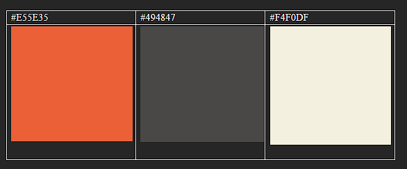
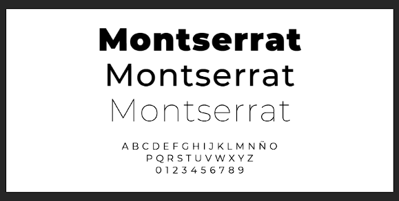
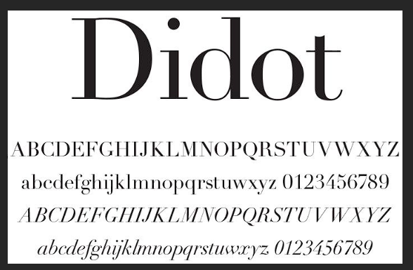

## **Capítulo IV: Product Design
## 4.1. Style Guidelines

Un "style guideline" o guía de estilo es un conjunto de reglas y pautas que establecen la forma en que se deben escribir, diseñar o presentar documentos, contenido web, software, o cualquier otro tipo de trabajo creativo. A continuación, se otorga especificación a los parámetros implementados en la estructura del proyecto.

### 4.1.1. General Style Guidelines

El color elegido es el #E55E35, que es un color variado del naranja. Con este color se busca dar confianza, creatividad y por ser un color de “éxito”. Luego tenemos al color gris #494847 por ser clásico y de calidad, y de fondo el color crema #F4F0DF.

- #E55E35
- #494847
- #F4F0DF

El tipo de letra primaria es “Montserrat”. Esta la hemos escogido para el título, texto y los temas párrafos de la Landing Page.

Para el resto de los textos que se encuentren en la aplicación se utilizará el tipo de fuente “Didot”.

### 4.1.2. Web Style Guidelines

El color elegido es el #E55E35, que es un color variado del naranja. Con este color se busca dar confianza, creatividad y por ser un color de “éxito”. Luego tenemos al color gris #494847 por ser clásico y de calidad, y de fondo el color crema #F4F0DF.

- #E55E35
- #494847
- #F4F0DF

El tipo de letra primaria es “Montserrat”. Esta la hemos escogido para el título, texto y los temas párrafos de la Landing Page.

## 4.2. Information Architecture

Esta sección se centra en cómo está organizado y presentado el contenido tanto en la aplicación web como en la landing page. Aquí se detallan los aspectos clave como los sistemas de organización, etiquetado, búsqueda y navegación, que son evaluados para determinar cómo se distribuye y estructura la información dentro de la plataforma.

### 4.2.1. Organization Systems

Para los sistemas de organización preferimos considerar estos 2 tipos: visual y secuencial.

#### Organización visual

Esta nos permite poder implementarla en la pantalla de inicio del usuario que desea administrar su inventario. Debido a la jerarquía,

### 4.2.2. Labeling Systems

El sistema de etiquetado de nuestra aplicación tendrá un uso muy simple y fácil de entender para que los usuarios de la aplicación puedan usarlo e identificar las opciones de manera rápida y sin problema alguno.

Para la barra de navegación se tiene en mente lo siguiente:

- **Inicio:** Esta sección muestra el contenido adaptado específicamente para cada tipo de usuario y es lo primero que ven una vez se hayan autenticado en la aplicación web.
- **Perfil:** Esta sección contiene todos los detalles relacionados con la información personal del usuario, incluyendo datos como nombre, dirección, preferencias, entre otros.
- **Inventario:** Aquí se encuentran todos los detalles relacionados con el inventario del restaurante, incluyendo productos, cantidades, proveedores, precios y cualquier otra información relevante para la gestión eficiente de los recursos.
- **Ajustes:** Aquí los usuarios pueden configurar diversas opciones y preferencias relacionadas con el funcionamiento y la apariencia de la aplicación, como notificaciones, idioma, seguridad, entre otros aspectos.

### 4.2.3. SEO Tags and Meta Tags

En esta sección, los usuarios pueden personalizar distintas configuraciones y ajustes que influyen tanto en cómo opera la aplicación como en su apariencia. Esto abarca aspectos como el manejo de notificaciones, la selección de idioma, medidas de seguridad, y otros aspectos relevantes.

| Meta Data ID | Explicación                            | Ejemplo                              |
|--------------|----------------------------------------|--------------------------------------|
| Title        | Define el título del documento        | `<title>Ejemplo<title/>`            |
| Author       | Indica el autor del documento         | `<meta name=”author” content=”Nombre del autor”>` |
| Keywords     | Especifica una lista de palabras claves relevantes para el contenido del documento | `<meta name=”keywords” content=”palabra1, palabra2, palabra3”>` |
| Content Type | Especifica el tipo de contenido y la codificación de caracteres utilizada en el documento | `<meta http-equiv=”Content-Type” content=”text/html; charset=utf-8">` |
| Description  | Sirve para que se pueda encontrar más rápido la página en el navegador. | `<meta name=”description” content=”Una breve descripcion del contenido”>` |

### 4.2.4. Searching Systems

Para esta parte, en la aplicación hemos decidido colocar dos tipos de sistemas de búsquedas: una barra de búsqueda y otra de filtros.

La barra de búsqueda podrá ayudar al usuario a encontrar en el inventario un producto específico, con un código único o el nombre del producto.

El sistema de búsqueda por filtro podrá ayudar al usuario a encontrar un grupo específico de productos de manera rápida y fácil.

### 4.2.5. Navigation Systems

Para garantizar que los usuarios tengan una experiencia fluida y comprensible, se ha diseñado una estructura de información clara y coherente. Esto implica que el sitio cuenta con una navegación estática, lo que significa que los usuarios siempre tendrán acceso a una guía constante que les permita moverse por el sitio de manera intuitiva.

Esta guía de navegación les proporciona la seguridad de que siempre podrán retroceder o avanzar según sea necesario, facilitando así su interacción con el sitio.

### 4.3. Landing Page UI Design.
#### 4.3.1. Landing Page Wireframe.
**Header:** Acá se muestra el header, en donde decidimos mantenerlo simple y conciso. A la izquierda se encuentra nuestro logo, después los botones principales de la página como Plans y About Us, y al final a la derecha los botones de Login y Sign Up.\
\
**Presentation:** Acá se puede ver la presentación de nuestra página. Toda la información que se necesita mostrar al inicio estará en esta parte, además de imágenes y datos relevantes.\
\
**ChefStock:** Acá se puede ver el encabezado ”ChefStock” de la página. Tiene la misma idea que la pagina Presentation, en donde tiene que mostrar imágenes y datos relevantes para el usuario, además de texto hablando sobre la aplicación.\ 
\
**Plans:** Acá se pueden ver los 3 planes que ofrecemos a los usuarios, junto a los beneficios de cada uno y sus costos.\ 
\
**About Us:** Acá se puede apreciar la presentación de los integrantes del equipo, cada uno con su foto personal y su nombre completo.\ 
\
**Footer:** Acá se puede ver el footer con sus respectivos botones, similares a los del header, como Presentation, Plans, y otros datos relevantes para la página.\ 
\
#### 4.3.2. Landing Page Mock-up.

### 4.4. Web Applications UX/UI Design.
#### 4.4.1. Web Applications Wireframes.

#### 4.4.2. Web Applications Wireflow Diagrams.

#### 4.4.3. Web Applications Mock-ups.

#### 4.4.4. Web Applications User Flow Diagrams.

#### 4.4.3. Web Applications Mock-ups.

### 4.5. Web Applications Prototyping.

### 4.6. Domain-Driven Software Architecture.
### 4.6.1. Software Architecture Context Diagram

### 4.6.2. Software Architecture Container Diagrams

### 4.6.3. Software Architecture Components Diagrams

## 4.7. Software Object-Oriented Design

### 4.7.1. Class Diagrams

### 4.7.2. Class Dictionary
**Trabajador:** Persona que trabaja en el restaurante y se encarga de diferentes actividades en el lugar. 

**Restaurante:** Entidad a donde los clientes van a realizar pedidos y se ubica el inventario. 

**Cliente:** Persona que va al restaurante a pedir comida y puede hacer comentarios al respecto. 

**Inventario:** Lugar en donde se almacena todos los productos que se utilizara en el restaurante. 

**Producto:** Entidad que se vende en los restaurantes y se guarda en el inventario por cierto periodo de tiempo.
## 4.8. Database Design
### 4.8.1. Database Diagram

