# **Capítulo V: Product Implementation, Validation & Deployment.
## 5.1. Software Configuration Management.
### 5.1.1. Software Development Environment Configuration.
- ### Proyect Management:
  * ### Whatsapp:
  
    
  
    * Esta es una plataforma de mensajería instantánea que funciona con sistemas operativos Android e iOS, y ha sido desarrollada por Meta. También ofrece una versión web que puede ser utilizada desde cualquier navegador. 
        [Link De Descarga](https://www.whatsapp.com/download//?l=uz&lang=es)
       
  * ### Discord:
    
    * Plataforma diseñada para facilitar la coordinación y realización de reuniones internas de manera semanal.   
      [Link De Descarga](https://discord.com/download)
    
  * ### Trello:
  
    * Aplicación destinada a la gestión de proyectos, que permite un seguimiento eficiente de las tareas asignadas a cada integrante del equipo.  
    [Link De Registro o Inicio De Sesión](https://trello.com/es)

- ### Requirement Management:

  * ### Miro:
    
    * Ofrece una variedad de plantillas para apoyar en la planificación y gestión de proyectos.  
      [Link De Registro o Inicio De Sesión](https://miro.com/es/login/)
  
  * ### UXPressia:
    
    * Herramienta online que permite el mapeo y análisis de las necesidades del cliente en proyectos específicos. 
      [Link De Registro o Inicio De Sesión](https://uxpressia.com)
  
  * ### Structurizr:
    
    * Suite de herramientas que facilita la creación colaborativa de modelos C4 para la representación gráfica de productos. 
      [Link De Registro o Inicio De Sesión](https://structurizr.com)
  
  * ### Vertabelo:
    
    * Plataforma colaborativa que permite diseñar de manera conjunta diagramas de bases de datos.  
      [Link De Registro o Inicio De Sesión](https://vertabelo.com)
      

- ###  Product UX/UI Design:
  * ### Figma:
  
    * Herramienta colaborativa útil para el desarrollo de wireframes y mockups.   
      [Link De Registro,Inicio De Sesión y Descarga](https://www.figma.com/downloads/)

  

  * ### LucidChart:
    * Permite la creación colaborativa de flujos de wireframes y mockups.   
    [Link De Registro o Inicio De Sesión ](https://www.lucidchart.com/pages/es)
  
- ###  Software Development:
* ### HTML5:
    

  *  Lenguaje de marcado empleado para estructurar páginas web, incluyendo elementos como texto, imágenes y videos. 
    [Informacion Relacionada](https://www.esic.edu/rethink/tecnologia/html5-que-es-caracteristicas-y-como-funciona-c#:~:text=El%20HTML5%20es%20un%20estándar,%2C%20estilo%20de%20letra%2C%20etc.)
  
  * ### CSS:
  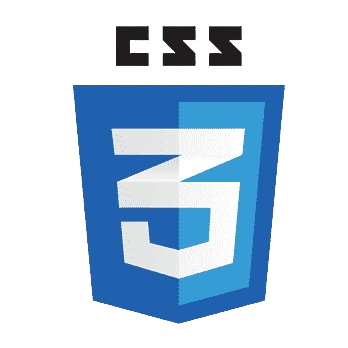
  
  * Lenguaje de diseño gráfico que se usa para formatear y estilizar documentos HTML.   
    [Informacion Relacionada](https://developer.mozilla.org/es/docs/Web/CSS)
  
  * ### JavaScript:
  
  * Lenguaje de programación dinámico orientado a objetos, utilizado para añadir interactividad a las páginas web.  
    [Informacion Relacionada]( https://developer.mozilla.org/es/docs/Web/JavaScript )
  
  * ### WebStorm:

  

  * Entorno de desarrollo integrado (IDE) especializado en JavaScript.  
    [Link De Descarga]( https://www.jetbrains.com/es-es/webstorm/)

- ###  Software Testing:
    * ### Lenguaje Gherkin:
    *  Lenguaje Específico de Dominio (DSL), diseñado para escribir pruebas de aceptación de una forma que sea comprensible para todos los participantes del proyecto.   
- ###  Software Documentation:
    * ### Github:
    * Plataforma de alojamiento para la gestión de código fuente, que facilita la colaboración entre desarrolladores.  
      [Link De Descarga]( https://desktop.github.com)
      [Link De Registro o Inicio De Sesión](https://github.com/login)
  

- ###  Software Deployment:
    * ### Firebase:
    Firebase es una plataforma de desarrollo de aplicaciones móviles y web que ofrece una variedad 	de servicios y herramientas para desarrolladores. Algunas de sus características incluyen:
    *  Autenticación: Proporciona autenticación de usuarios con opciones como inicio de sesión con correo electrónico, Google, Facebook, etc. 
    *  Base de datos en tiempo real: Ofrece una base de datos en tiempo real en la nube para almacenar y sincronizar datos entre dispositivos. 
    *  Hosting: Permite alojar y desplegar aplicaciones web y sitios estáticos directamente desde la plataforma. 
    *  Funciones en la nube: Permite ejecutar código en la nube en respuesta a eventos específicos. 
    *  Almacenamiento en la nube: Proporciona almacenamiento de archivos y objetos en la nube.
    *  Notificaciones push: Facilita el envío de notificaciones push a dispositivos móviles. 
    *  Analíticas: Ofrece herramientas para rastrear el rendimiento de la aplicación y el comportamiento de los usuarios. 
    * ### Github Pages:
    GitHub Pages es un servicio de alojamiento web gratuito proporcionado por GitHub. Algunas		características clave son: 
    *  Despliegue directo desde repositorios: Permite alojar sitios web estáticos directamente desde un repositorio de GitHub. 
    *  Dominio personalizado: Puedes configurar un dominio personalizado para tu sitio alojado en GitHub Pages. 
    *  Generación automática de páginas: Si tu repositorio contiene archivos HTML, Markdown o Jekyll, GitHub Pages generará automáticamente las páginas web correspondientes. 
    *  Soporte para HTTPS: Proporciona cifrado HTTPS para los sitios alojados. 

### 5.1.2. Source Code Management.

Landing Page Repository: [Landing Page Repository](https://github.com/U201910146/ChefStock)
- #### GitFlow Implementation:
  * Para adoptar el modelo de ramificación Gitflow en nuestro manejo de versiones con Git, nos hemos guiado por el artículo "A successful Git branching model" de Vincent Driessen. Este recurso ha sido esencial para definir las convenciones específicas que implementaremos en nuestro proyecto.

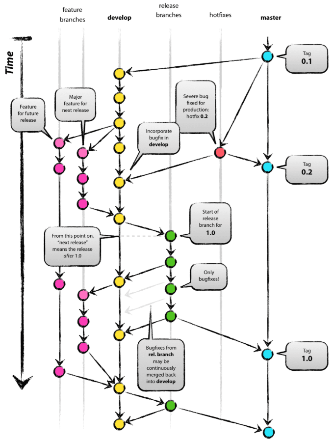

- ### **Master o Main branch**
   * Rama Principal, Master o Main branch,contiene el código que actualmente está en producción. Se la conoce como la Master branch o Main branch.

  * #### Notación: master o main

- ### **Develop branch**
  * Rama de Desarrollo, Develop branch, en la rama Develop se acumulan las últimas actualizaciones y cambios que se incorporarán en la próxima versión. Funciona como un entorno de integración y prueba continua antes de que los cambios se fusionen con la rama principal para el despliegue en producción.
  * #### Notación: develop

- ### **Release branch**
  * La rama de lanzamiento, Release branch, facilitará la preparación de una nueva versión del producto. Esta rama permitirá la corrección de errores y permitirá que la rama Develop reciba más actualizaciones.
  
     Debe derivarse de la rama Develop.
     Debe fusionarse con la rama Develop y Master.
  * #### Notación: release

- ### **Feature branch**
  * Rama de Características (Feature branch): Las Feature branches se utilizan para desarrollar nuevas funcionalidades que se incluirán en la siguiente versión o futuras iteraciones. Estas ramas deben originarse desde Develop y eventualmente fusionarse de vuelta a Develop.
  
     Debe derivarse de la rama Develop.
     Debe fusionarse de vuelta a la rama Develop.
  * #### Notación: release

- ### **Hotfix branch**
  * Rama de Corrección Rápida (Hotfix branch): Utilizada para abordar errores críticos en la versión de producción, la Hotfix branch permite la rápida implementación de soluciones mientras el equipo sigue trabajando en otras mejoras. Debe originarse desde Master y fusionarse tanto con Develop como con Master.
    
     Debe derivarse de la rama Master
     Debe fusionarse con la rama Develop y Master
  * #### Notación: hotfix

- ### **Conventional Commits**
  * Compromisos Convencionales (Conventional Commits): Es una metodología para estructurar los mensajes de confirmación de cambios en un formato estándar y semántico. Facilita la comunicación de modificaciones y ayuda en la automatización de registros de cambios. El formato típico incluye un encabezado, un cuerpo opcional y un pie de página opcional, y ayuda a describir claramente los cambios para un seguimiento y comprensión efectivos por parte del equipo. 
La estructura de un commit debe seguir las siguientes pautas:
~~~
git commit -m “<type>[optional scope]: <title>“ -m “<description”
~~~
**Tipos De Conventional Commits**
~~~
1. **feat**: Se usa para describir una nueva característica o funcionalidad añadida al código.
2. **fix**: Indica una corrección de errores o solución a un problema.
3. **docs**: Se emplea para cambios o mejoras en la documentación del código.
4. **style**: Describe cambios relacionados con el formato del código, como espacios en blanco, sangrías, etc., que no afectan su funcionalidad.
5. **refactor**: Se utiliza para modificaciones en el código que no corrigen errores ni añaden nuevas funcionalidades, sino que mejoran su estructura o legibilidad.
6. **test**: Indica la adición o modificación de pruebas unitarias o funcionales.
7. **chore**: Se usa para cambios en el proceso de construcción o tareas de mantenimiento que no están directamente relacionadas con el código en sí.
8. **perf**: Describe mejoras de rendimiento en el código.
~~~

### 5.1.3. Source Code Style Guide & Conventions.

Como norma general, se espera que el código escrito por los miembros del equipo esté en inglés.
- ### HTML
  - #### Use Lowercase Element Names:
    Es aconsejable usar minúsculas para los nombres de los elementos HTML.
      ~~~ 
    <body>
          
Esto es un párrafo

    <body>
     ~~~
  - #### Close All HTML Elements:
    Es importante asegurarse de cerrar correctamente todos los elementos HTML.
      ~~~ 
    <body>
          
Esto es un párrafo

          
Esto es otro párrafo

    <body>
     ~~~
    

  - #### Use Lowercase Attribute Names:
    Se recomienda usar minúsculas para los nombres de los atributos en HTML.
    ~~~ 
    <a href="https://www.w3schools.com/html/">Visit our HTMLtutorial</a>
     ~~~
    

  - #### Always Specify alt, width, and height for Images:
    Es prudente usar estas especificaciones para mejorar la accesibilidad en caso de que la imagen no se muestre.
    ~~~ 
    
    ~~~ 
  - #### Spaces and Equal Signs:
    Se sugiere evitar espacios entre el nombre del atributo, el signo igual y el valor para mejorar la legibilidad.
    ~~~ 
    <link rel="stylesheet" href="styles.css">
    ~~~ 
- ### CSS
  - #### ID and Class Naming
    Se deben usar nombres significativos que expresen claramente la función del elemento.
    ~~~ 
    #gallery {}
    #login {}
    .video {}
     ~~~
  - #### ID and Class Name Style
    Prefiera nombres cortos pero descriptivos para facilitar la comprensión de su propósito.
    ~~~ 
    #nav {}
    .author {}
    ~~~
  - #### Shorthand Properties
    Se aconseja usar propiedades CSS en forma abreviada para aumentar la eficiencia y comprensibilidad del código.
     ~~~ 
     border-top: 0;
     font: 100%/1.6 palatino, georgia, serif;
     padding: 0 1em 2em;
     ~~~ 
  - #### 0 and Units
    Se recomienda omitir la unidad después de un valor cero para optimizar el tamaño y la legibilidad del código.
     ~~~ 
     margin: 0;
     padding: 0;
     ~~~
  - #### Declaration Order
    Se sugiere ordenar las declaraciones alfabéticamente para mejorar el mantenimiento y recordación del código.
    ~~~ 
     background: fuchsia;
     border: 1px solid;
     border-radius: 4px;
     color: black;
     text-align: center;
     text-indent: 2em;
    ~~~  
- ### JAVASCRIPT
  - #### Use expanded syntax
    Se recomienda escribir cada declaración en una nueva línea, con las llaves abriendo en la misma línea de la declaración y cerrando en una nueva línea al final.
    ~~~ 
    function myFunc() {
     console.log('Hello!');
    };
    ~~~
  - #### Variable naming
    Utilizar lowerCamelCase para el nombre de las variables.
    ~~~ 
    let playerScore = 0;
    let speed = distance / time;
    ~~~  
  - #### Declaring variables
    Se prefiere el uso de let y const sobre var.
    ~~~ 
    const myName = 'Chris';
    console.log(myName);
    let myAge = '40';
    myAge++;
    console.log('Happy birthday!');
    ~~~ 
  - #### Function naming
    Usar lowerCamelCase y empezar con un verbo que describa la acción de la función.
    ~~~ 
    function sayHello() {
    alert('Hello!');
    };
    ~~~

### 5.1.4. Software Deployment Configuration.

- Creacion Landing Page: 
1. Se crea un repositorio remoto en GitHub

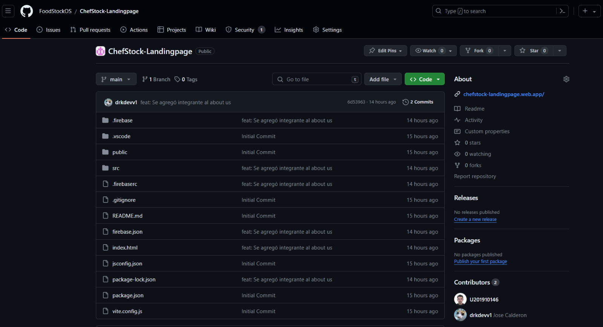

2. Agregar a participantes:

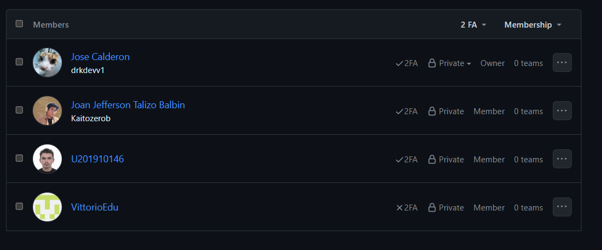

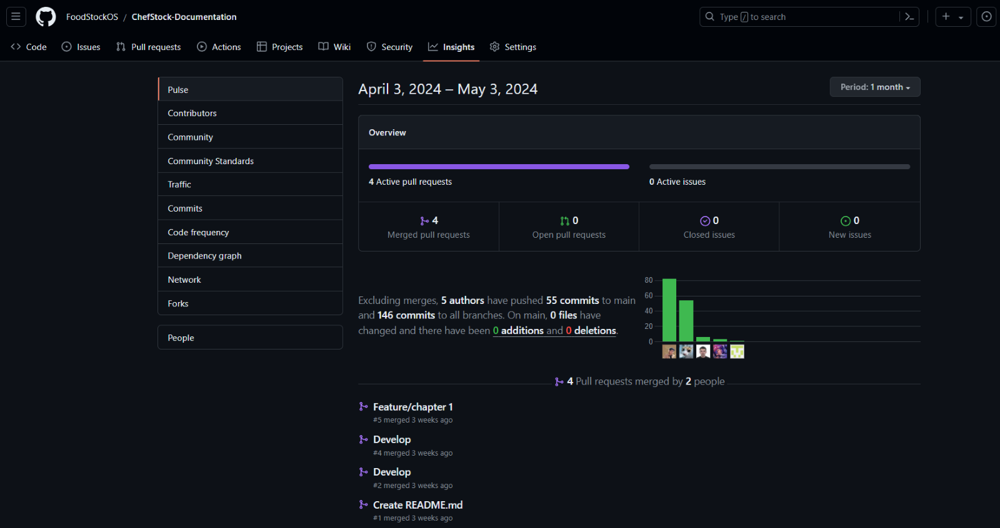

3. Creamos un proyecto en Firebase para poder desplegar la landing page: 
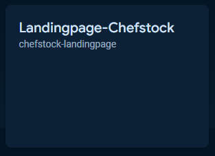

4. Iniciamos el hosting:
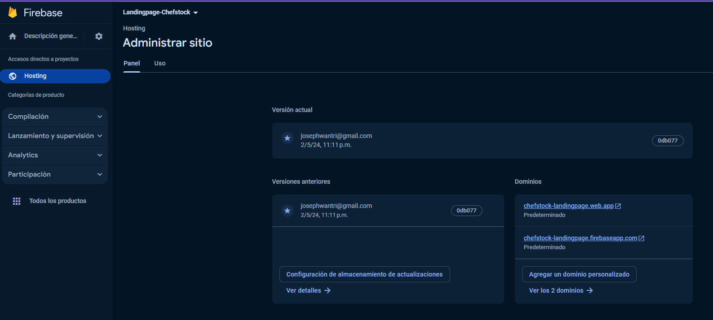

5. Y desplegamos la Landing page: https://chefstock-landingpage.web.app/ 
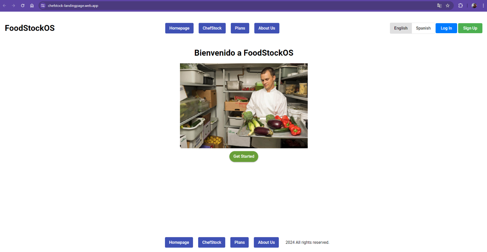

## 5.2. Landing Page, Services & Applications Implementation.

### 5.2.1. Sprint 1 
Durante el primer sprint, nos enfocaremos en la creación de la Landing Page, dividiendo equitativamente las tareas identificadas entre los miembros del equipo para garantizar un avance fluido y eficiente en el desarrollo. 
#### 5.2.1.1 Sprint Planning 1
<table>
    <thead>
        <tr>
            <th colspan="">Sprint #</th>
            <th>1</th>
        </tr>
    </thead>
    <tbody>
        <tr>
            <th colspan="2">Sprint Planning Background</th>
        </tr>
        <tr>
            <th>Date</th>
            <td>2024/04/1</td>
        </tr>
        <tr>
            <th>Time</th>
            <td>17:00 pm</td>
        </tr>
        <tr>
            <th>Location</th>
            <td>Sala de reuniones virtual (Discord)</td>
        </tr>
        <tr>
            <th>Prepared By</th>
            <td>Tomás Ortiz Fajardo</td>
        </tr>
        <tr>
            <th>Attendees (to planning meeting)</th>
            <td>Joan Talizo Balbin, Jose Calderon, Adrian Quiroz Caceres, Vittorio Eduardo Espinoza, Tomás Ortiz Fajardo</td>
        </tr>
        <tr>
            <th>Sprint 1 Review Summary</th>
            <td>Es la primera reunión donde se evaluarán los puntos que se harán por funciones. </td>
        </tr>
        <tr>
            <th>Sprint Planning Background</th>
            <td>Se acordó que durante este sprint se centrarán en la creación de la Landing Page y se dividirán equitativamente las tareas identificadas entre los miembros del equipo.</td>
        </tr>
        <tr>
            <th colspan="2">Sprint Goal & User Stories</th>
        </tr>
        <tr>
            <th>Sprint 1 Goal</th>
            <td>Durante este sprint, el objetivo principal es crear la Landing Page para el proyecto. Esto incluye diseñar y desarrollar una página de aterrizaje atractiva y funcional que cumpla con los requisitos del proyecto. Se asignarán las User Stories relacionadas con la creación de la Landing Page a los miembros del equipo, y el sprint se considerará exitoso si todas estas historias de usuario están implementadas y funcionando correctamente al finalizar el sprint.</td>
        </tr>
        <tr>
            <th>Sprint 1 Velocity</th>
            <td>Se establece un Velocity de 20 Story Points para este Sprint.</td>
        </tr>
        <tr>
            <th>Sum of Story Points</th>
            <td>15 Story Points</td>
        </tr>
    </tbody>
</table>

#### 5.2.1.2 Sprint  Backlogs 
<table>
    <thead>
        <tr>
            <th>Sprint #</th>
            <th colspan="7">Sprint 1</th>
        </tr>
        <tr>
            <th>User Story</th>
            <th colspan="7">Work-Item/Task</th>
        </tr>
        <tr>
            <th>Id</th>
            <th>Title</th>
            <th>Id</th>
            <th>Title</th>
            <th>Description</th>
            <th>Estimación (Horas)</th>
            <th>Assigned To</th>
            <th>Status (to-do/In-process/To-Review/Done)</th>
        </tr>
    </thead>
    <tbody>
        <tr>
            <td>HU-01</td>
            <td>Barra de navegación clara </td>
            <td>1</td>
            <td>Diseñar la estructura de la barra de navegación  </td>
            <td>Crear el diseño visual de la barra de navegación para garantizar la claridad y funcionalidad.  </td>
            <td>3</td>
            <td>Tomás Ortiz Fajardo </td>
            <td>Done</td>
        </tr>
        <tr>
            <td>HU-02</td>
            <td>Visualizar la sección "Quiénes Somos?"</td>
            <td>1</td>
            <td>Crear contenido para la sección "Quiénes Somos?"</td>
            <td>Redactar la historia, misión y visión de la empresa para mostrar en la sección "Quiénes Somos?".</td>
            <td>3</td>
            <td>Tomás Ortiz Fajardo </td>
            <td>Done</td>
        </tr>
        <tr>
            <td>HU-03</td>
            <td>Desarrollar el diseño de la sección "Servicios</td>
            <td>1</td>
            <td>Desarrollar el diseño de la sección "Servicios"</td>
            <td>Diseñar visualmente la sección "Servicios" para mostrar los servicios ofrecidos por la empresa.</td>
            <td>4</td>
            <td>Tomás Ortiz Fajardo </td>
            <td>Done</td>
        </tr>
        <tr>
            <td>HU-04</td>
            <td>Visualizar información sobre el Sección Equipo de Trabajo</td>
            <td>1</td>
            <td>Recopilar información del equipo  </td>
            <td>Recopilar fotos, roles y descripciones de los miembros del equipo para mostrar en la sección "Equipo de Trabajo".</td>
            <td>2</td>
            <td>Tomás Ortiz Fajardo </td>
            <td>Done</td>
        </tr>
    </tbody>
</table>

#### 5.2.1.3 Development Evidence for Sprint Review
<table>
    <thead>
        <tr>
            <th>Repository</th>
            <th>Branch</th>
            <th>Commit ID</th>
            <th>Commit Message</th>
            <th>Commit Message Body</th>
            <th>Commited on (Date)</th>
        </tr>
    </thead>
    <tbody>
        <tr>
            <td>FoodStockOS/ChefStock-Documentation</td>
            <td>feature/chapter-1</td>
            <td>d31321ad518e1743ab49c5e39fdb7d24d12a2fa4</td>
            <td>feat: added Team member profiles</td>
            <td></td>
            <td>14/04/24</td>
        </tr>
        <tr>
            <td>FoodStockOS/ChefStock-Documentation</td>
            <td>feature/chapter-1</td>
            <td>3d54b5d45e1697eee4b1d22b63bfc40b41400198 </td>
            <td>Update chapter01.md</td>
            <td></td>
            <td>14/04/24</td>
        </tr>
        <tr>
            <td>FoodStockOS/ChefStock-Documentation</td>
            <td>feature/chapter-1</td>
            <td>9ab50dcc4f1a50ea60f5947705c20f271139f1ac</td>
            <td>Update chapter01.md</td>
            <td></td>
            <td>14/04/24</td>
        </tr>
        <tr>
            <td>FoodStockOS/ChefStock-Documentation</td>
            <td>feature/chapter-2</td>
            <td>49fa25fc9bf12ae50a9908cf9c270d071c7d17c3</td>
            <td>feat: added competitive analysis</td>
            <td></td>
            <td>14/04/24</td>
        </tr>
        <tr>
            <td>FoodStockOS/ChefStock-Documentation</td>
            <td>feature/chapter-2</td>
            <td>a51fb295c36732648f12626cbb885ef558459bed</td>
            <td>feat: added Interview design</td>
            <td></td>
            <td>14/04/24</td>
        </tr>
        <tr>
            <td>FoodStockOS/ChefStock-Documentation</td>
            <td>feature/chapter-2</td>
            <td>39ad83bcae3e6a40326ac51bdc4f5d44dd4e9b95</td>
            <td>docs: Se agregaron los puntos 2.3.3 , 2.3.5 y 2.4</td>
            <td></td>
            <td>02/05/24</td>
        </tr>
        <tr>
            <td>FoodStockOS/ChefStock-Landingpage</td>
            <td>main</td>
            <td>6ee16c6fab4b6eaa67eb52b70f75661628d9b0a7</td>
            <td>Initial Commit</td>
            <td></td>
            <td>02/05/24</td>
        </tr>
        <tr>
            <td>FoodStockOS/ChefStock-Documentation</td>
            <td>feature/chapter-3</td>
            <td>2f874db47dddb0992be8c25bf9fdb258ab8d3a55</td>
            <td>Modify chapter03.md</td>
            <td></td>
            <td>03/05/24</td>
        </tr>
        <tr>
            <td>FoodStockOS/ChefStock-Documentation</td>
            <td>feature/chapter-4</td>
            <td>9ba1592b4826187b88943c24e49a9c7e06d15481</td>
            <td>feat: add modify chapter04.md</td>
            <td></td>
            <td>03/05/24</td>
        </tr>
    </tbody>
</table>

#### 5.2.1.4 Testing Suite Evidence for Sprint Review
Durante este sprint, llevamos a cabo las funcionalidades definidas en nuestro Sprint Backlog, asegurándonos de incluir sus criterios de aceptación correspondientes.\

#### 5.2.1.5 Execution Evidence for Sprint Review
Durante el primer sprint, el equipo de desarrollo de la startup FoodStockOS logró completar la creación de la Landing Page para nuestro proyecto ChefStock. En nuestra página web, los usuarios podrán acceder a detalles sobre...
#### 5.2.1.6 Services Documentation Evidence for Sprint Review
Hasta ahora, no disponemos de documentación de nuestros servicios, ya que este primer sprint se ha centrado en el desarrollo de la Landing Page.
#### 5.2.1.7 Software Deployment Evidence for Sprint Review
Inicialmente creamos el repositorio en Github exclusivamente para la implementar la Landing page:

Utilizamos Firebase para el despliegue:

Finalmente la desplegamos:
 

Además, configuramos otro repositorio específicamente para el informe del proyecto. Dentro de este repositorio, creamos ramas principales como "main" y "developer", así como ramas específicas para cada capítulo bajo el nombre "feature/". 

#### 5.2.1.8 Team Collaboration Insights during Sprint
Durante el transcurso del primer sprint, todos los miembros del equipo de FoodStockOS participamos activamente y de forma constante en la ejecución de las tareas asignadas. 

Presentamos pruebas del progreso individual:

 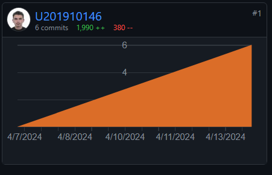
 

### 5.2.2. Sprint 2 
En este informe se describen las correcciones efectuadas en el documento completo, junto con las áreas que requieren atención para desarrollar la primera versión de la aplicación web front-end "ChefStock". 

Durante la revisión del informe completo, se identificaron secciones que necesitaban ajustes y mejoras para asegurar la calidad y coherencia del documento. Estas mejoras se centraron en la claridad de la presentación, la precisión de los datos y la cohesión del contenido. 

Además de las correcciones realizadas, se han señalado puntos específicos para enfocarse en la creación de la primera versión de la aplicación web front-end "ChefStock". Estos puntos incluyen aspectos como el diseño de la interfaz de usuario, la implementación de funciones clave y la optimización del rendimiento del sitio web.
#### 5.2.2.1 Sprint Planning 2
<table>
    <thead>
        <tr>
            <th colspan="">Sprint #</th>
            <th>2</th>
        </tr>
    </thead>
    <tbody>
        <tr>
            <th colspan="2">Sprint Planning Background</th>
        </tr>
        <tr>
            <th>Date</th>
            <td>2024/05/1</td>
        </tr>
        <tr>
            <th>Time</th>
            <td>19:00 pm</td>
        </tr>
        <tr>
            <th>Location</th>
            <td>WhatsApp</td>
        </tr>
        <tr>
            <th>Prepared By</th>
            <td>Tomás Ortiz Fajardo</td>
        </tr>
        <tr>
            <th>Attendees (to planning meeting)</th>
            <td>Joan Talizo Balbin, Jose Calderon, Adrian Quiroz Caceres, Vittorio Eduardo Espinoza, Tomás Ortiz Fajardo</td>
        </tr>
        <tr>
            <th>Sprint 2 Review Summary</th>
            <td>Es la segunda reunión donde se evaluarán los puntos que se harán por funciones. </td>
        </tr>
        <tr>
            <th>Sprint Planning Background</th>
            <td>Se acordó que durante este sprint se centrarán en la creación de la Front-end web Application y se dividirán equitativamente las tareas identificadas entre los miembros del equipo.</td>
        </tr>
        <tr>
            <th colspan="2">Sprint Goal & User Stories</th>
        </tr>
        <tr>
            <th>Sprint 2 Goal</th>
            <td>Durante este sprint, el objetivo principal es crear la Front-end web Application. Esto incluye diseñar y desarrollar un sitio web atractivo y funcional que cumpla con los requisitos del proyecto. Se asignarán las User Stories relacionadas con la creación del Front-end web Application a los miembros del equipo, y el sprint se considerará exitoso si todas estas historias de usuario asignadas están implementadas y funcionando correctamente al finalizar el sprint.</td>
        </tr>
        <tr>
            <th>Sprint 2 Velocity</th>
            <td>Se establece un Velocity de 25 Story Points para este Sprint. </td>
        </tr>
        <tr>
            <th>Sum of Story Points</th>
            <td>32 Story Points</td>
        </tr>
    </tbody>
</table>

#### 5.2.2.2 Sprint  Backlogs 
<table>
    <thead>
        <tr>
            <th>Sprint #</th>
            <th colspan="7">Sprint 2</th>
        </tr>
        <tr>
            <th>User Story</th>
            <th colspan="7">Work-Item/Task</th>
        </tr>
        <tr>
            <th>Id</th>
            <th>Title</th>
            <th>Id</th>
            <th>Title</th>
            <th>Description</th>
            <th>Estimación (Horas)</th>
            <th>Assigned To</th>
            <th>Status (to-do/In-process/To-Review/Done)</th>
        </tr>
    </thead>
    <tbody>
        <tr>
            <td>HU-05</td>
            <td>Crear nueva cuenta </td>
            <td>5</td>
            <td>Diseñar la estructura de la página de registro </td>
            <td>Crear el diseño visual de la página de registro y funcionalidad </td>
            <td>3</td>
            <td>Tomás Ortiz Fajardo </td>
            <td>Done</td>
        </tr>
        <tr>
            <td>HU-06</td>
            <td>Iniciar sesión en la plataforma </td>
            <td>6</td>
            <td>Diseñar la estructura de la página de inicio de sesión </td>
            <td>Crear el diseño visual de la página de inicio de sesión y funcionalidad </td>
            <td>3</td>
            <td>Tomás Ortiz Fajardo </td>
            <td>Done</td>
        </tr>
        <tr>
            <td>HU-07</td>
            <td>Ver página de perfil </td>
            <td>7</td>
            <td>Desarrollar el diseño del perfil de usuario</td>
            <td>Diseñar e implementar la sección del perfil de usuario </td>
            <td></td>
            <td>Joan Jefferson Talizo Balbin </td>
            <td>Done</td>
        </tr>
        <tr>
            <td>HU-08</td>
            <td>Editar página de perfil </td>
            <td>8</td>
            <td>Desarrollar la funcionalidad para editar la pagina de perfil </td>
            <td>Desarrollar la funcionalidad para que cada usuario pueda editar su perfil de la plataforma </td>
            <td></td>
            <td>Joan Jefferson Talizo Balbin </td>
            <td>In-process</td>
        </tr>
        <tr>
            <td>HU-09</td>
            <td>Visualizar información de productos </td>
            <td>9</td>
            <td>Desarrollar la página para visualizar los productos </td>
            <td>Desarrollar la página para los productos de la plataforma para que el usuario pueda visualizar su inventario en tiempo real </td>
            <td>3</td>
            <td>Jose Daniel Mario Calderon Huaman </td>
            <td>Done</td>
        </tr>
        <tr>
            <td>HU-10</td>
            <td>Añadir producto </td>
            <td>10</td>
            <td>Desarrollar la funcionalidad para añadir un nuevo producto </td>
            <td>Desarrollar la funcionalidad para añadir un nuevo producto al inventario de cada usuario de la plataforma </td>
            <td>2</td>
            <td>Jose Daniel Mario Calderon Huaman </td>
            <td>Done</td>
        </tr>
        <tr>
            <td>HU-11</td>
            <td>Modificar producto </td>
            <td>11</td>
            <td>Desarrollar la funcionalidad para editar un producto </td>
            <td>Desarrollar la funcionalidad para editar un producto para que el usuario tenga actualizado su inventario </td>
            <td></td>
            <td>Jose Daniel Mario Calderon Huaman </td>
            <td>In-process</td>
        </tr>
    </tbody>
</table>

#### 5.2.2.3 Development Evidence for Sprint Review
<table>
    <thead>
        <tr>
            <th>Repository</th>
            <th>Branch</th>
            <th>Commit ID</th>
            <th>Commit Message</th>
            <th>Commit Message Body</th>
            <th>Commited on (Date)</th>
        </tr>
    </thead>
    <tbody>
        <tr>
            <td>FoodStockOS/ChefStock-Frontend</td>
            <td>main</td>
            <td>3271c5211e57af773a41ea5c188dc9256510578c</td>
            <td>feat(login) created login</td>
            <td></td>
            <td>03/05/24</td>
        </tr>
        <tr>
            <td>FoodStockOS/ChefStock-Frontend</td>
            <td>main</td>
            <td>a5669fb123b244e601c402013055ed8a01dd86dd</td>
            <td>feat(products): add partial functionality for products section</td>
            <td></td>
            <td>03/05/24</td>
        </tr>
        <tr>
            <td>FoodStockOS/ChefStock-Frontend</td>
            <td>main</td>
            <td>27baabfc2300706ce86195f40cc422601ca3c8e6</td>
            <td>feat(homepage): Created Homepage </td>
            <td></td>
            <td>03/05/24</td>
        </tr>
        <tr>
            <td>FoodStockOS/ChefStock-Frontend</td>
            <td>main</td>
            <td>521237385be4d09d1c51ac5df204e027ff0197c9</td>
            <td>feat: Cambios de estilo en products y homepage </td>
            <td></td>
            <td>03/05/24</td>
        </tr>
        <tr>
            <td>FoodStockOS/ChefStock-Frontend</td>
            <td>main</td>
            <td>fa9099aec3315efbc6a9ae309a2dd8a09f40aea1</td>
            <td>Merge pull request #17 from FoodStockOS/feat/homepage </td>
            <td></td>
            <td>03/05/24</td>
        </tr>
        <tr>
            <td>FoodStockOS/ChefStock-Frontend</td>
            <td>main</td>
            <td>c0b588b39d25481c34dde5da420b0fa20b2e5b50</td>
            <td>feat: Se agregó funcionalidad de eliminación de productos y un nuevo componente para la edición de cada producto </td>
            <td></td>
            <td>03/05/24</td>
        </tr>
    </tbody>
</table>

#### 5.2.2.4 Testing Suite Evidence for Sprint Review
Durante este segundo sprint, hemos implementado parcialmente todas las funcionalidades definidas en nuestro Sprint Backlog 2, asegurándonos de cumplir con sus criterios de aceptación correspondientes. 

#### 5.2.2.5 Execution Evidence for Sprint Review
Durante el segundo sprint, el equipo de desarrollo de FoodStockOS inició la creación de la Aplicación front end para nuestro proyecto ChefStock. En nuestro sitio web, los usuarios pueden acceder a información sobre sus productos para que puedan llevar un seguimiento detallado de todos los elementos necesarios para su operación diaria. 
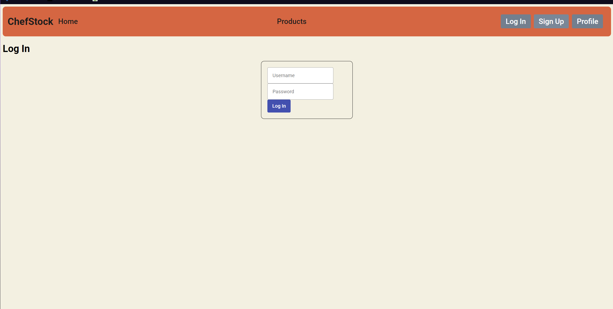

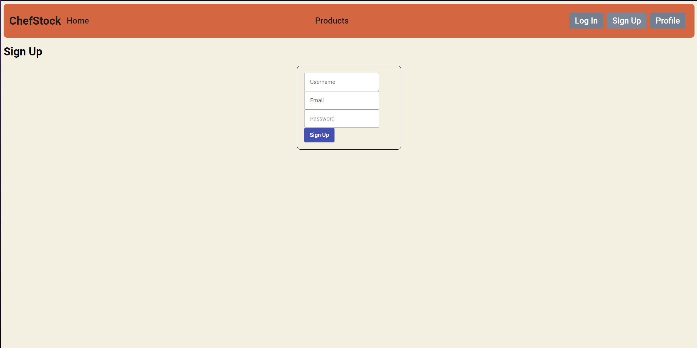

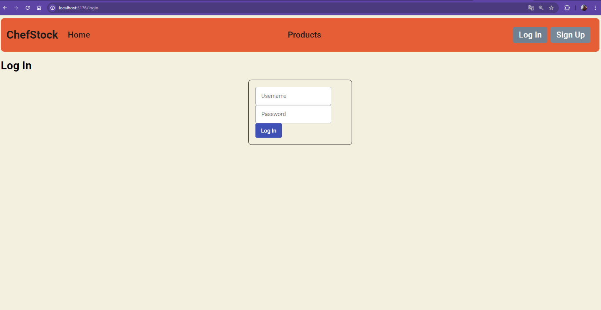

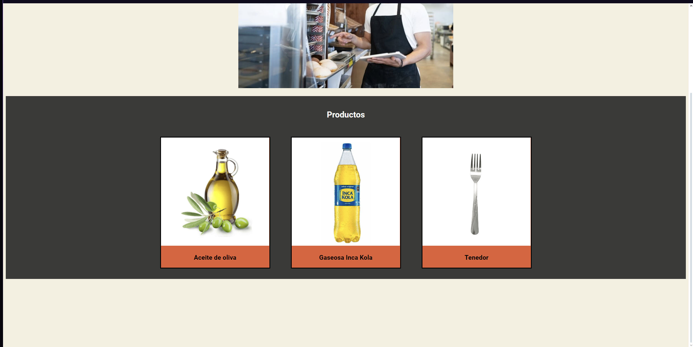

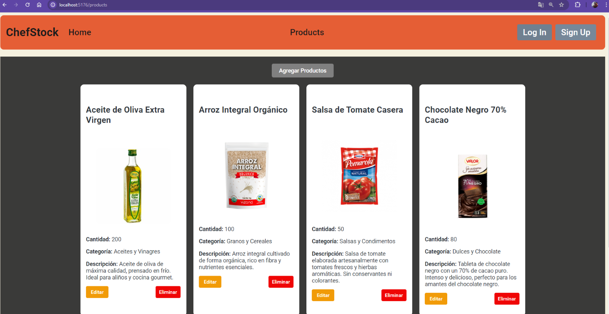

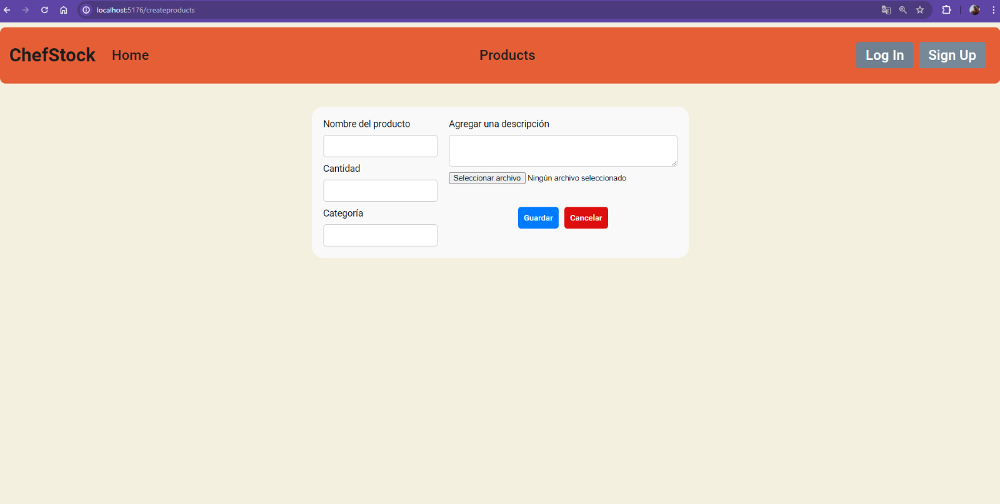

#### 5.2.2.6 Services Documentation Evidence for Sprint Review
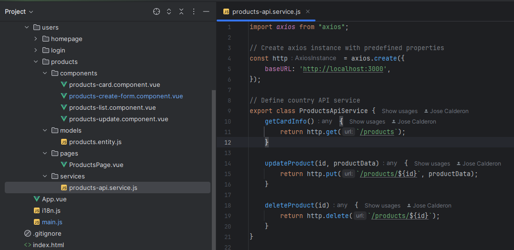
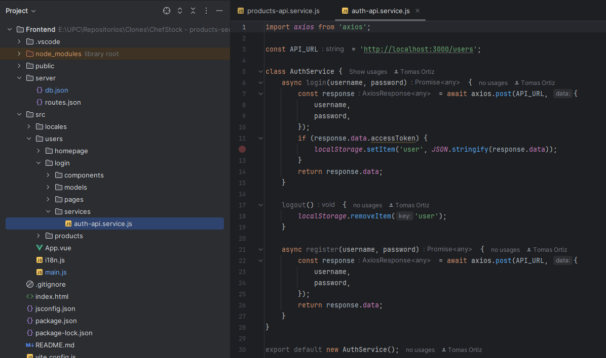
#### 5.2.2.7 Software Deployment Evidence for Sprint Review
Inicialmente creamos el repositorio en Github exclusivamente para la implementar la App
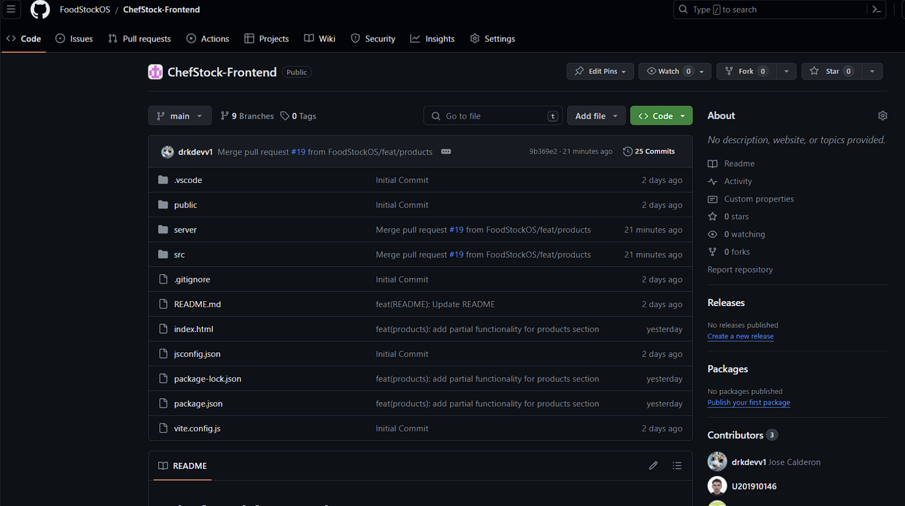

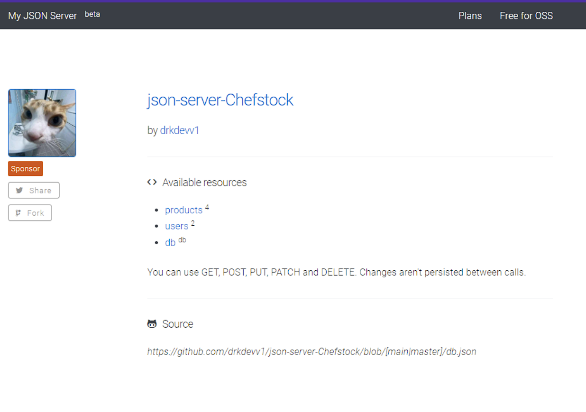

Utilizamos Firebase para el despliegue:
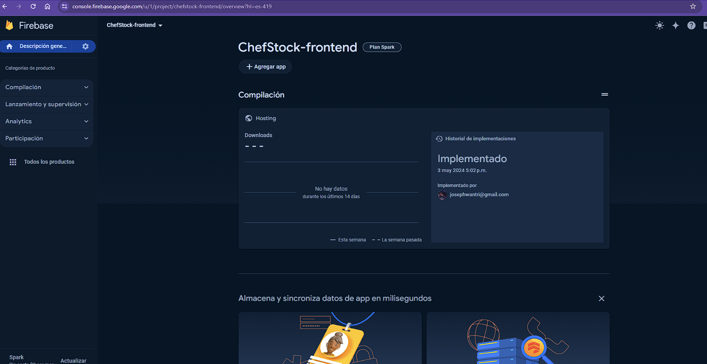

Finalmente la desplegamos:
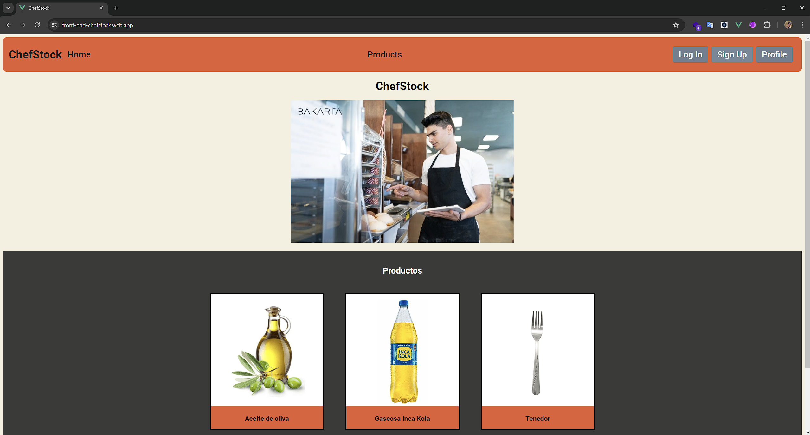

Link: https://front-end-chefstock.web.app/

#### 5.2.2.8 Team Collaboration Insights during Sprint
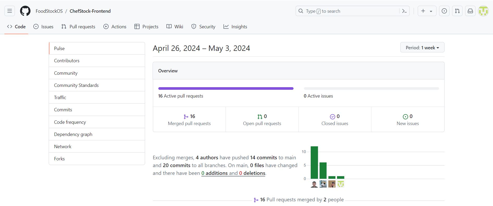

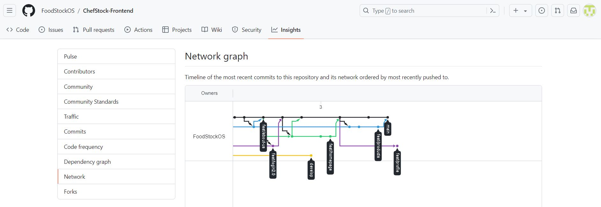

### 5.2.3. Sprint 3 
En este informe se describen las acciones realizadas para desarrollar la primera versión del back-end "ChefStock", así como algunas mejoras en lo que respecta al front-end. 

Se han agregado puntos específicos para enfocarse en la creación de la nueva versión de la aplicación web front-end "ChefStock". Estos puntos incluyen aspectos como mejora de la página principal, edición de perfil funcional y correcciones en la sección de productos. 

Además, se ha realizado la primera versión del back-end, el cual contiene las características básicas de una base de datos que servirá como un punto de inicio y mejorará continuamente. 
#### 5.2.3.1 Sprint Planning 3
En esta sección se documenta y detalla el progreso alcanzado en términos de producto y colaboración durante el Sprint número 3. Se presenta todo el avance descriptivo junto con su desarrollo, historial y contribuciones de cada integrante del equipo. Todas las especificaciones se derivan del Product Backlog del Capítulo 3 de requisitos.

*Tabla del planeamiento a profundidad del Sprint 3.*
<table>
    <thead>
        <tr>
            <th colspan="">Sprint #</th>
            <th>3</th>
        </tr>
    </thead>
    <tbody>
        <tr>
            <th colspan="2">Sprint Planning Background</th>
        </tr>
        <tr>
            <th>Date</th>
            <td>2024/06/4</td>
        </tr>
        <tr>
            <th>Time</th>
            <td>22:00 pm</td>
        </tr>
        <tr>
            <th>Location</th>
            <td>WhatsApp</td>
        </tr>
        <tr>
            <th>Prepared By</th>
            <td>Tomás Ortiz Fajardo</td>
        </tr>
        <tr>
            <th>Attendees (to planning meeting)</th>
            <td>Joan Talizo Balbin, Jose Calderon, Adrian Quiroz Caceres, Vittorio Eduardo Espinoza, Tomás Ortiz Fajardo</td>
        </tr>
        <tr>
            <th>Sprint 3 Review Summary</th>
            <td>Para este Sprint 3, hemos decidido implementar principalmente las historias de usuario que aporten un valor significativo a nuestro proyecto, dejando de lado otras funcionalidades adicionales o dependientes, ya que priorizamos las historias de usuario más importantes y valiosas. Además, en este Sprint 3, hemos decidido realizar las correcciones indicadas por el profesor, tanto en el FrontEnd (aplicación web) como en el BackEnd, incorporando posibles mejoras sugeridas en ambos. </td>
        </tr>
        <tr>
            <th>Sprint Planning Background</th>
            <td>En la retrospectiva del Sprint 3, hemos analizado en conjunto cómo utilizamos nuestro tiempo como equipo para mejorar nuestra organización. Utilizamos herramientas como Trello para asignar y coordinar tareas, lo que nos permitió tener un mejor control sobre nuestro proyecto. Para optimizar la asignación de tareas, decidimos dividir cada tarea en procesos más pequeños, permitiendo así que todos trabajemos de manera más eficiente. Esta organización implica desglosar nuestro proyecto grande en partes más manejables, distribuidas según diferentes dominios. </td>
        </tr>
        <tr>
            <th colspan="2">Sprint Goal & User Stories</th>
        </tr>
        <tr>
            <th>Sprint 3 Goal</th>
            <td>Durante este sprint, el objetivo principal es desarrollar las primeras versiones de nuestro BackEnd, creando versiones iniciales y preliminares. También nos propusimos mejorar continuamente nuestros repositorios (FrontEnd, Reporte y LandingPage). A nivel interno, como grupo, nos enfocamos en mejorar nuestra organización utilizando aplicaciones como Trello o ClickUp. De esta manera, definimos nuestras metas de forma adecuada. </td>
        </tr>
        <tr>
            <th>Sprint 3 Velocity</th>
            <td>Se establece un Velocity de 25 Story Points para este Sprint. </td>
        </tr>
        <tr>
            <th>Sum of Story Points</th>
            <td>32 Story Points</td>
        </tr>
    </tbody>
</table>

#### 5.2.3.2 Sprint  Backlogs 3

Para esta sección se revisará todo el proceso llevado a cabo para el Sprint Backlog 3, donde nuestro equipo se enfocó principalmente en el diseño, estructuración y organización de la lógica de negocio en nuestra aplicación web, utilizando servicios diferenciados y modelos de base de datos. Además, se planteó un modelo futuro para el intercambio de información entre el FrontEnd y el BackEnd. Dividimos toda la construcción del BackEnd en 4 historias de usuario, asegurando que cada miembro del grupo completara al menos dos. Gracias a este proceso, al finalizar el Sprint Backlog 3, logramos tener una página web estable, con interfaces bien diseñadas, conexiones con APIs externas, entre otros.

*Tabla principal del planeamiento del Sprint Backlog 3.*
<table>
    <thead>
        <tr>
            <th>Sprint #</th>
            <th colspan="7">Sprint 3</th>
        </tr>
        <tr>
            <th>User Story</th>
            <th colspan="7">Work-Item/Task</th>
        </tr>
        <tr>
            <th>Id</th>
            <th>Title</th>
            <th>Id</th>
            <th>Title</th>
            <th>Description</th>
            <th>Estimación (Horas)</th>
            <th>Assigned To</th>
            <th>Status (to-do/In-process/To-Review/Done)</th>
        </tr>
    </thead>
    <tbody>
        <tr>
            <td>HU-08</td>
            <td>Editar página de perfil </td>
            <td>8</td>
            <td>Desarrollar la funcionalidad para editar la pagina de perfil </td>
            <td>Desarrollar la funcionalidad para que cada usuario pueda editar su perfil de la plataforma </td>
            <td></td>
            <td>Joan Jefferson Talizo Balbin </td>
            <td>In-process</td>
        </tr>
        <tr>
            <td>HU-09</td>
            <td>Visualizar información de productos </td>
            <td>9</td>
            <td>Desarrollar la página para visualizar los productos </td>
            <td>Desarrollar la página para los productos de la plataforma para que el usuario pueda visualizar su inventario en tiempo real </td>
            <td>3</td>
            <td>Jose Daniel Mario Calderon Huaman </td>
            <td>Done</td>
        </tr>
        <tr>
            <td>HU-10</td>
            <td>Añadir producto </td>
            <td>10</td>
            <td>Desarrollar la funcionalidad para añadir un nuevo producto </td>
            <td>Desarrollar la funcionalidad para añadir un nuevo producto al inventario de cada usuario de la plataforma </td>
            <td>2</td>
            <td>Jose Daniel Mario Calderon Huaman </td>
            <td>Done</td>
        </tr>
        <tr>
            <td>HU-11</td>
            <td>Modificar producto </td>
            <td>11</td>
            <td>Desarrollar la funcionalidad para editar un producto </td>
            <td>Desarrollar la funcionalidad para editar un producto para que el usuario tenga actualizado su inventario </td>
            <td></td>
            <td>Jose Daniel Mario Calderon Huaman </td>
            <td>Done</td>
        </tr>
    </tbody>
</table>

Con el fin de que la lista de tareas en el sprint pueda ser visualizada a más profundidad, se mostrara un enlace directo a la sección de trabajo designada por el equipo junto a todas las actividades de forma completa. Hemos usado Trello como nuestra herramienta para planificar actividades.

*Presentación de la tabla de actividades designada para el Sprint 3 en Trello.*
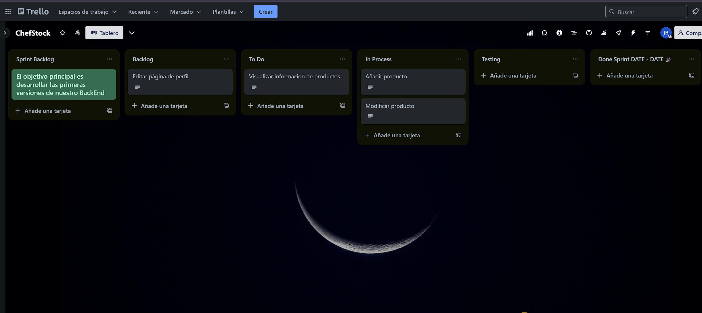

#### 5.2.3.3 Development Evidence for Sprint Review
<table>
    <thead>
        <tr>
            <th>Repository</th>
            <th>Branch</th>
            <th>Commit ID</th>
            <th>Commit Message</th>
            <th>Commit Message Body</th>
            <th>Commited on (Date)</th>
        </tr>
    </thead>
    <tbody>
        <tr>
            <td>FoodStockOS/ChefStock-Frontend</td>
            <td>main</td>
            <td>e154ad7c25db129a486ec7b111fdf062e70200ab</td>
            <td>feat: add product update form and enhance project visuals</td>
            <td></td>
            <td>26/05/24</td>
        </tr>
        <tr>
            <td>FoodStockOS/ChefStock-Frontend</td>
            <td>main</td>
            <td>c3e3835ff41fd3bc0a93369ab3de3bfcb36b8eb6</td>
            <td>feat(homepage): botones e imagen añadidos </td>
            <td></td>
            <td>30/05/24</td>
        </tr>
        <tr>
            <td>FoodStockOS/ChefStock-Backend</td>
            <td>main</td>
            <td>4e2facaf65cfdaa355264c7ca94e30719d7f9012</td>
            <td>Initial commit </td>
            <td></td>
            <td>31/05/24</td>
        </tr>
        <tr>
            <td>FoodStockOS/ChefStock-Backend</td>
            <td>main</td>
            <td>0cad156cb2848d9087ce6e210f088b6c5cfbac9c</td>
            <td>feat: add Products bounded context</td>
            <td></td>
            <td>07/06/24</td>
        </tr>
        <tr>
            <td>FoodStockOS/ChefStock-Backend</td>
            <td>main</td>
            <td>cb81b0f7a0ac2ad1d4bbe0d1a0edeab22bc872ad</td>
            <td>feat: redefine DDD elements in InventoryManagement bounded context</td>
            <td></td>
            <td>08/06/24</td>
        </tr>
        <tr>
            <td>FoodStockOS/ChefStock-Backend</td>
            <td>main</td>
            <td>98f07ab81c786ee4428963eed261a23e128530f7</td>
            <td>feat: add Category and Supplier entities</td>
            <td></td>
            <td>09/06/24</td>
        </tr>
        <tr>
            <td>FoodStockOS/ChefStock-Backend</td>
            <td>main</td>
            <td>4ae88708720bd4f0a161f111cfc113cc2102e4dd</td>
            <td>Update chefstock-platform.dll</td>
            <td></td>
            <td>09/06/24</td>
        </tr>
        <tr>
            <td>FoodStockOS/ChefStock-Backend</td>
            <td>main</td>
            <td>a1e27b42b4165e50e5ab3eac174a67667cd91128</td>
            <td>feat: add RestaurantManagement bc</td>
            <td></td>
            <td>09/06/24</td>
        </tr>
        <tr>
            <td>FoodStockOS/ChefStock-Backend</td>
            <td>main</td>
            <td>29f43b52884ea92be8b4fdac93a2e4d287b2781f</td>
            <td>feat: add Supplier commands, queries, repository and controller</td>
            <td></td>
            <td>09/06/24</td>
        </tr>
        <tr>
            <td>FoodStockOS/ChefStock-Backend</td>
            <td>main</td>
            <td>d19a4843dec81d5f6005c0da615da815cc8a76d6</td>
            <td>feat: add UserManagement bounded context and update InventoryManagement</td>
            <td></td>
            <td>09/06/24</td>
        </tr>
    </tbody>
</table>

#### 5.2.3.4 Testing Suite Evidence for Sprint Review
Durante este tercer sprint, hemos implementado parcialmente todas las funcionalidades definidas en nuestro Sprint Backlog 3, asegurándonos de cumplir con sus criterios de aceptación correspondientes. 

#### 5.2.3.5 Execution Evidence for Sprint Review
Durante el tercer sprint, el equipo de desarrollo de FoodStockOS mejoró la parte del frontend e inició la creación del back-end para nuestro proyecto ChefStock. En nuestro frontend, la página principal se le agregaron botones que redirigen a nuestras otras secciones, así como mejoramos algunos aspectos a la sección de agregar productos. 
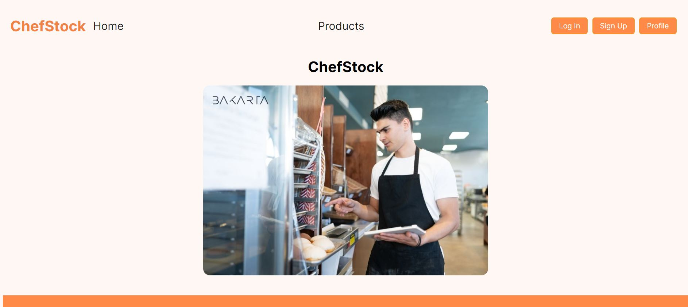

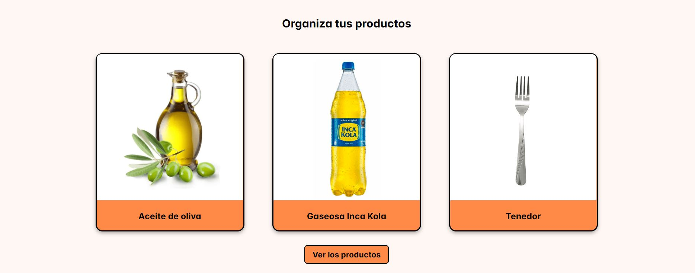

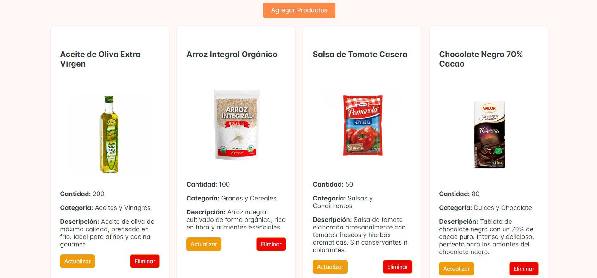

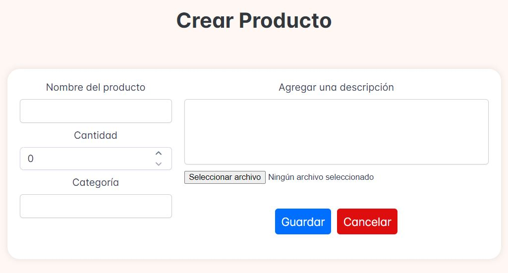

#### 5.2.3.6 Services Documentation Evidence for Sprint Review
En esta sección, presentamos la relación de EndPoints documentados con OpenAPI utilizando Swagger como herramienta visual. Ajuntamos evidencias de la implementación de los EndPoints.

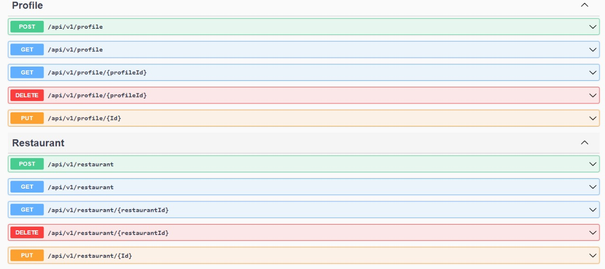

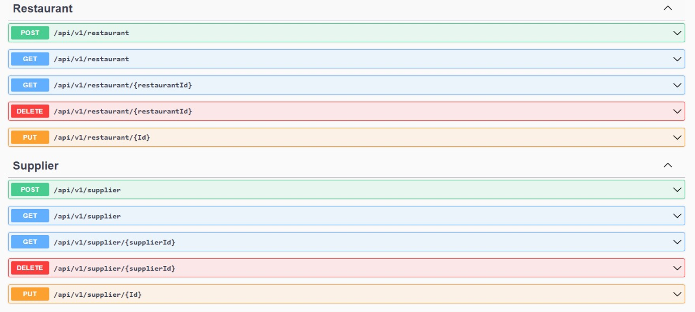

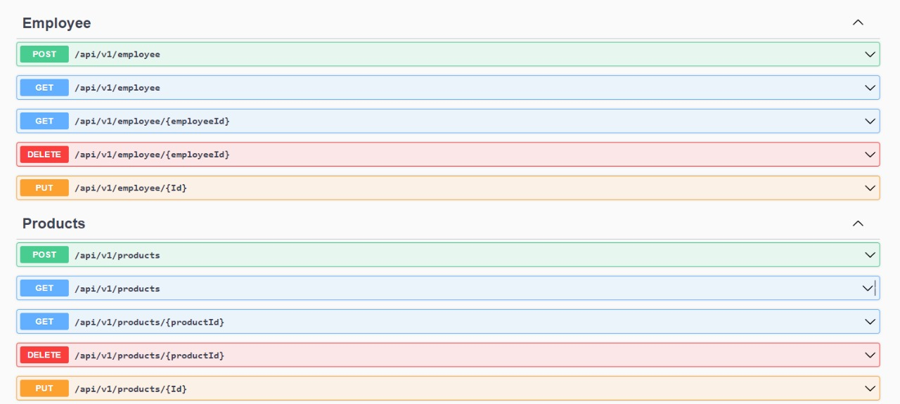

#### 5.2.3.7 Software Deployment Evidence for Sprint Review

Dentro del Sprint 3, realizamos el despliegue de:
##### Landing Page
Mejoramos el landing page a base de las recomendaciones de nuestro profesor. El link a nuestra Landing Page: [Clic aquí para ir a Landing Page](https://chefstock-landingpage.web.app/)

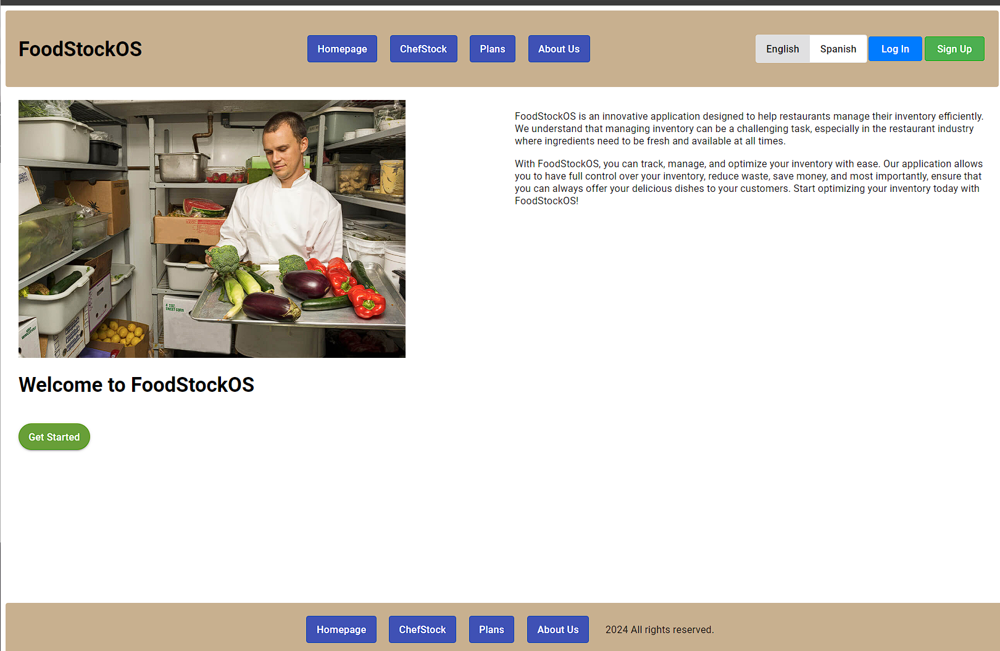

##### Front End
Entre varios cambios y mejoras, hemos incluído Fake-APIs a nuestro Front-End por el momento para después conectar y crear la comunicación de ambas partes. Además, se agreago la parte de Únete a nosotros. Dejamos el link de nuestro Front End: [Clic aquí para ir a Aplicación Web](https://front-end-chefstock.web.app/)

##### Back End
Presentamos la primera versión den nuestro BackEnd. Esta primera versión contiene EndPoints que añadan valor a nuestro negocio, implementando capas de seguridad como características primarias de registro e inicio de sesión.

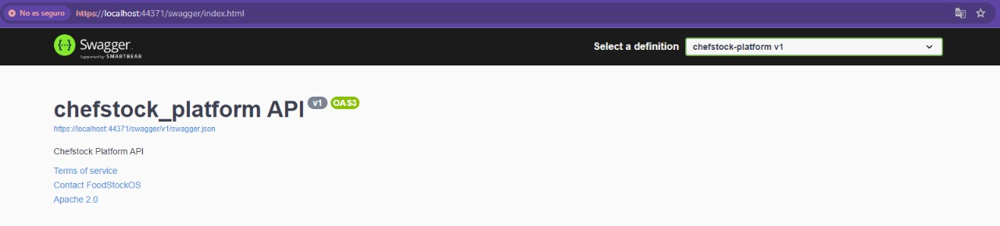

#### 5.2.3.8 Team Collaboration Insights during Sprint

Durante el Sprint 3, nos enfocamos en el desarrollo colaborativo del BackEnd del Web Application de ChefStock junto a la mejora del FrontEnd y nuestro Landing Page donde cada miembro del equipo contribuyó con sus habilidades y conocimientos. Esta colaboración se refleja en los numerosos commits, pull request, y reuniones que realizados en nuestro repositorio de código y herramientas externas, los cuales están respaldados por capturas de pantalla adjuntas para una documentación detallada.

Nuestro equipo se reunió tanto en virtualmente para asignar tareas y discutir la estrategia de desarrollo del proyecto. Estas reuniones fueron cruciales para clarificar nuestras responsabilidades individuales y asegurar un desempeño óptimo. Para maximizar la eficiencia, decidimos asignar a cada miembro del equipo una sección específica del BackEnd para desarrollar, lo que nos permitió avanzar rápidamente y cumplir con los plazos establecidos.

Además, programamos sesiones regulares de brainstorming y resolución de problemas, donde compartimos ideas y abordamos cualquier duda o dificultad que surgiera durante el proceso de desarrollo. Estas reuniones fueron fundamentales para resolver obstáculos de manera efectiva y garantizar un progreso constante en la elaboración del BackEnd del Web Application.

Report:

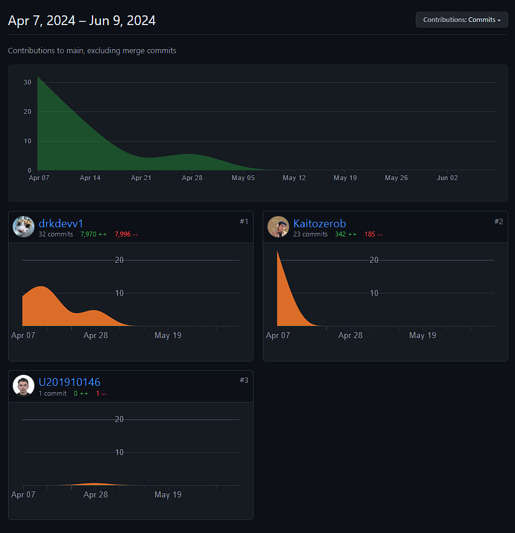

Front:

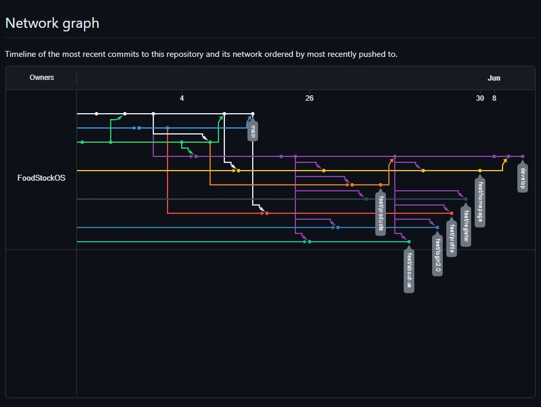

Back:

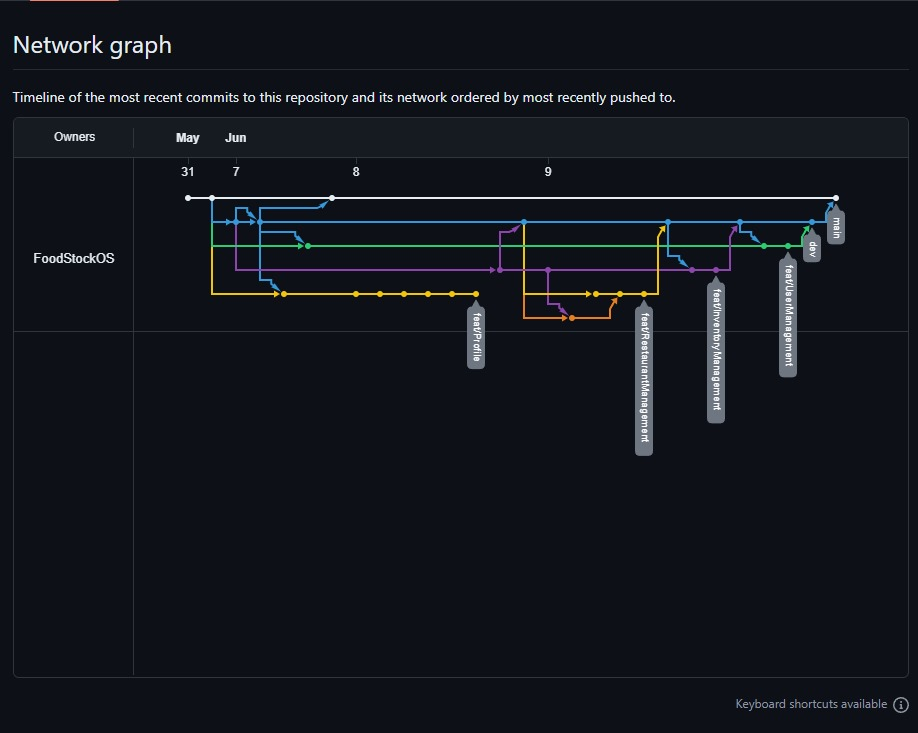

### 5.2.4. Sprint 4
#### 5.2.4.1. Sprint Planning 4.
En esta sección se explicaran los detalles presentados y analizados durante la reunión del Sprint Planning para el número 4. El objetivo principal de esta reunión es establecer un plan claro y realista para el sprint, identificando las tareas a realizar y comprometiéndose con un conjunto de entregables concretos que contribuyan al avance del proyecto. A continuación, se presenta el resumen del Sprint Planning Meeting, que proporcionará una visión general de los temas discutidos y las decisiones tomadas durante la reunión.  

| Sprint #| Sprint 4                                                                                                                                                                                                                                                                                                       |
|---------|----------------------------------------------------------------------------------------------------------------------------------------------------------------------------------------------------------------------------------------------------------------------------------------------------------------|
|Sprint Planing Background|                                                                                                                                                                                                                                                                                                                |
|Date| 2024-06-08                                                                                                                                                                                                                                                                                                     |
|Time | 41.00                                                                                                                                                                                                                                                                                                          |
|Location| Reunion Virtual(Plataforma Discord)                                                                                                                                                                                                                                                                            |
|Prepared By| Tomás Ortiz Fajardo                                                                                                                                                                                                                                                                                            |
|Attendees (to planning meeting)| Todos los asistentes del equipo                                                                                                                                                                                                                                                                                |
|Sprint 4 Review Summary| La entrega pasada  tuvimos ciertas correcciones que necesitabamos revisar como el informe, mejorar algunos aspectos de los videos y terminar con el frontend y backend.                                                                                                                                        |
|Sprint 4 Retrospective Summary| El desarrollo del sprint 4 tuvo varios errores y algunos comentarios de retroalimentación, pero como equipo de trabajo se levanto las observaciones respecto al tercer sprint.                                                                                                                                 |
|Sprint Goals & User Stories| US01 al US20                                                                                                                                                                                                                                                                                                   |
|Sprint 4 Goal| Como meta para este sprint queremos dejar terminado la web application completa, incluyendo el frontend, backend y la landing page. Además queremos terminar el informe para su revision en esta entrega. Asimismo, realizar la conexión del frontend con el backend y desplegar la versión final del proyecto. |
|Sprint 4 Velocity| La velocidad de este sprint es de 23                                                                                                                                                                                                                                                                           |
|Sprints of Story Points|                                                                                                                                                                                                                                                                                                                |

#### 5.2.4.2. Sprint Backlog 4.
En esta sección se revisará todo el proceso dado para el Sprint Backlog 4, en el cual nuestro equipo de trabajo se centró principalmente en la implementación de los puntos faltantes de la entrega anterior

| Id   | Title                             | Id  | Title                                             | Description                                                                                  | Estimations (Hours) | Assigned To               | Status |
|------|-----------------------------------|-----|---------------------------------------------------|----------------------------------------------------------------------------------------------|---------------------|---------------------------|--------|
| CC01 | Implementar producto              | C04 | Implementar los productos                         | Desarrollo e implementación del producto  que corresponden  conectando el frontend y backend | 2                   | Tomás Ortiz Fajardo       | Done   |
| CC02 | Arreglar el Backend               | C01 | Desarrollar las correciones del backend           | Desarrollo de las correciones del backend                                                    | 5                   | Jose Calderon Huaman      | Done   |
| CC03 | Despliegue del backend            | C02 | Desarrollar el despliegue el backend en azure     | Desarrollo del depliegue del backend en azure                                                | 3                   | Joan Talizo Balbin        | Done   |
| CC04 | Unión del frontend con el backend | C03 | Desarollorar la union del frontend con el backend | Desarrollar la unión del frontend con el backend                                             | 3                   | Jose Calderon Huaman      | Done   |
| CC05 | Realización de entrevistas        | C05 | Desarollorar las entrevistas correspondientes     | Desarrollar las entrevistas correspondientes de cada segmento                                | 3                   | Vittorio Eduardo Espinoza | Done   |

#### 5.2.4.3. Development Evidence for Sprint Review.
En esta sección, se describen los avances en la implementación de los productos de la solución relacionados con los Web Services, según el alcance del Sprint 4. Aquí se presentarán los commits ya implementados en el repositorio de GitHub, junto con toda la información relevante y los cambios realizados.  
Tabla de los commits realizados y relacionados con el desarrollo de todas las secciones del Sprint Backlog 3.  

#### 5.2.4.4. Testing Suite Evidence for Sprint Review.

| Repository | Branch           | Commit ID | Commit Message                                                                  | Commit Date |
|------------|-------------------|-----------|---------------------------------------------------------------------------------|-------------|
| ChefStock-UPC | feat/dev     | 74e1e7852557ad8b2cd3df4675bfc00cb39188e2   | Fix: fix corrected ID errors for PUT, DELETE and POST                                                       | 09/06/2024  |
|            | feat/dev         | 71bdc5cf3b3189cddb306e84806bf7d0ac5cc0bf   | Feat: Add the docker file                                                           | 26/06/2024  |
|            | feat/dev    | 9aeac36d7a3b7bef4ffc6bfd235e9186847f4db9   | Feat Change categories in ECategory                                    | 26/06/2024  |
|            | feat/dev    | 8f5c5eb113171ca34e5e1157396ef7cdb946acfb   | Refactor: Update products bounded context integration with backend                                               | 21/06/2024  |
|            | feat/dev     | 29f43b52884ea92be8b4fdac93a2e4d287b2781f  | Feat: Add supplie commands, queries, repository and controller                                                  | 21/06/2024  |
|            | feat/dev      | d7d8e1de634c25a51cab04c542f7c387e6daf5ef   | Feat: Update the Program.cs file                                    | 23/06/2024  |

#### 5.2.4.5. Execution Evidence for Sprint Review.

En este sprint 4, hemos logrado implementar las características clave de la API principal de la startup junto a toda su lógica de negocio y la base de datos. Todas las historias de usuario asignadas para este sprint fueron completadas exitosamente.   

#### 5.2.4.6. Services Documentation Evidence for Sprint Review.

En esta sección, se describen los EndPoints documentados con OpenAPI mediante la herramienta Swagger para el sprint 4. Esto permite una visualización clara de los puntos de acceso de la API y sus características. Asimismo, se adjuntan evidencias de la implementación de dichos EndPoints.

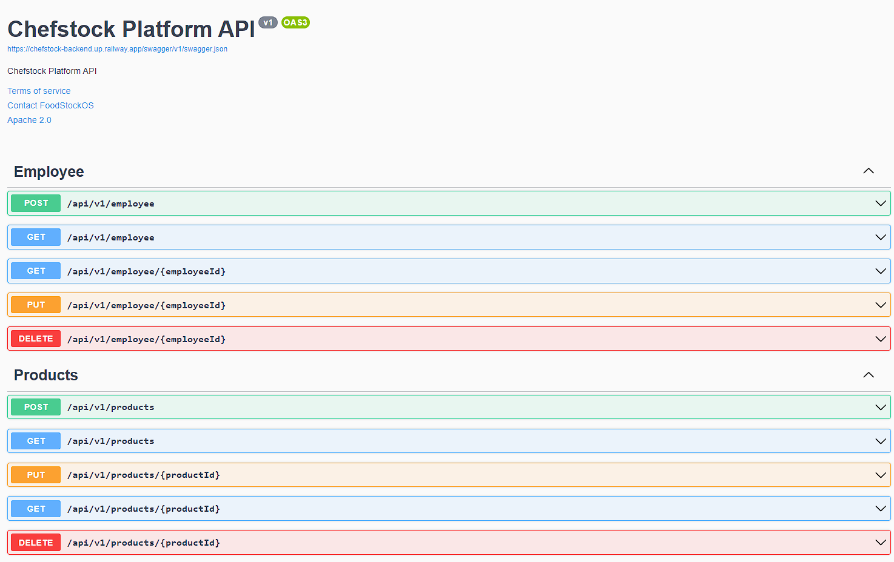

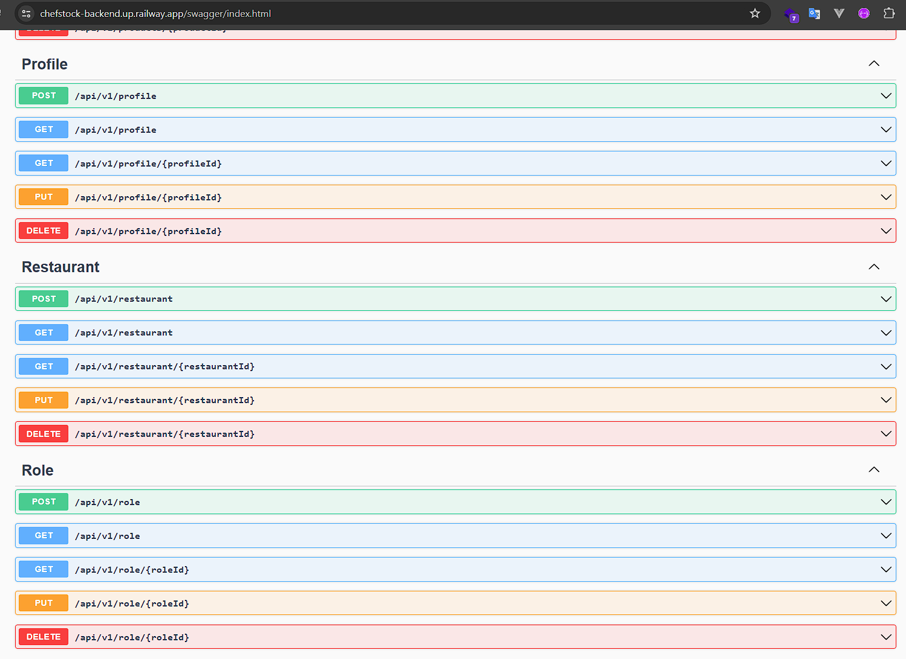

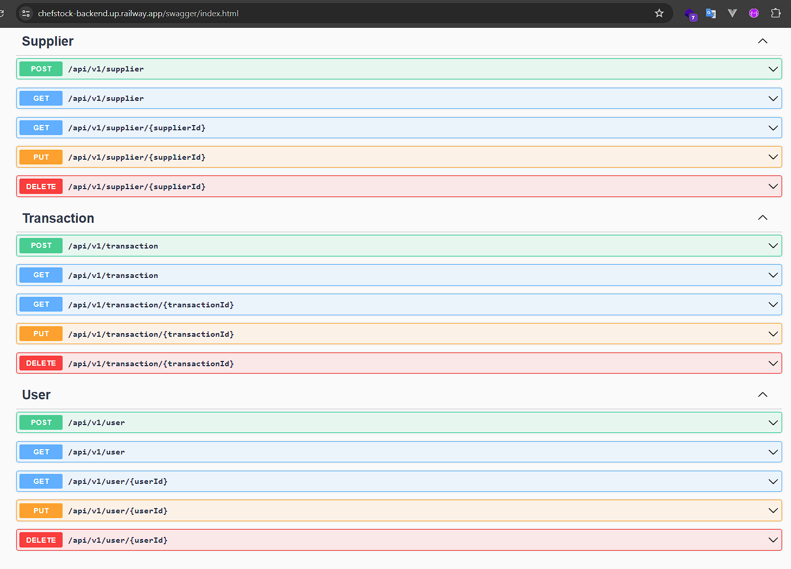

#### 5.2.4.7. Software Deployment Evidence for Sprint Review.
Para este sprint 4, se realizo un deploy del backend y la conexión del frontend con el backend. Se logró una correcta comunicación entre el FrontEnd y el BackEnd de manera estable.

Landing Page
Mejoramos el landing page a base de las recomendaciones de nuestro profesor. El link a nuestra Landing Page: 
[Clic aquí para ir a Landing Page](https://chefstock-landingpage.web.app/)

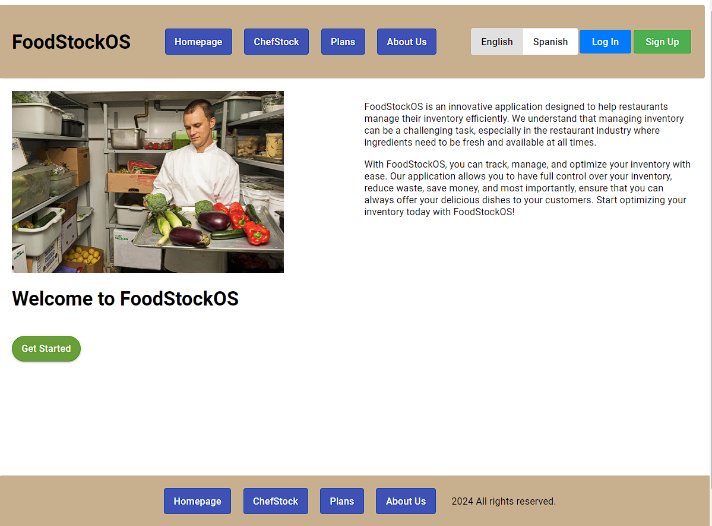

**Front End**

Entre varios cambios y mejoras, hemos incluído APIs a nuestro Front-End.  Dejamos el link de nuestro Front End:

[Clic aquí para ir a la Aplicación Web](https://front-end-chefstock.web.app/)

**Backend Deployment**

Presentamos la primera versión den nuestro BackEnd. Esta primera versión contiene EndPoints que añadan valor a nuestro negocio
[CLic aquí para ver el Swagger](https://chefstock-platform.azurewebsites.net/swagger/index.html)

Video Software Deployment Evidence for Sprint Review: https://youtu.be/fHBPE-OIxSU

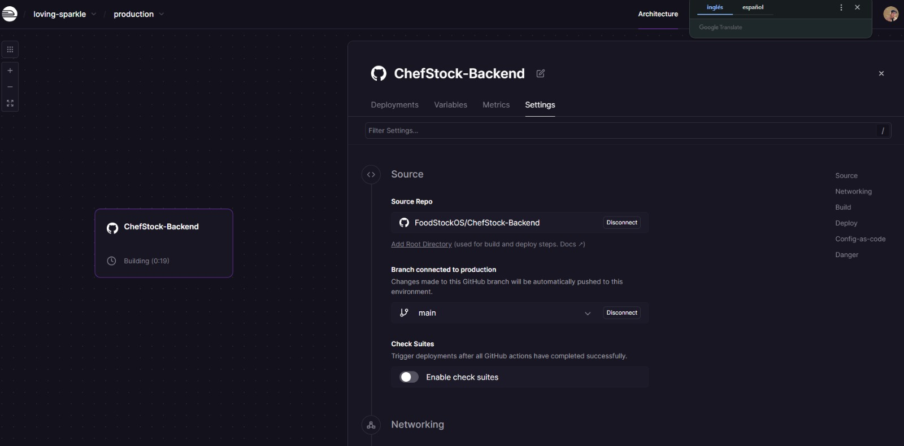

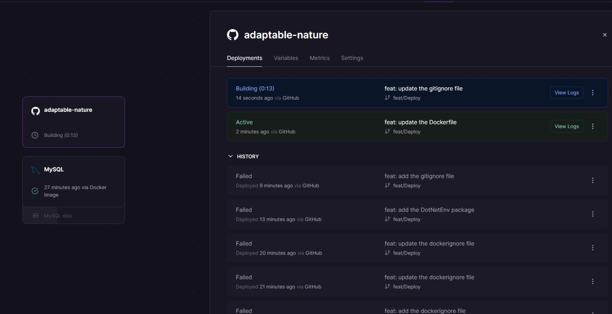

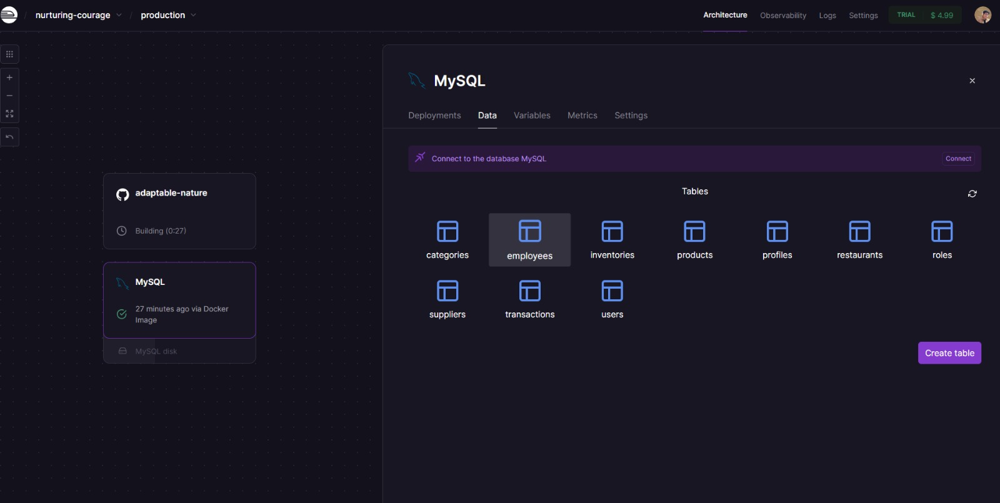

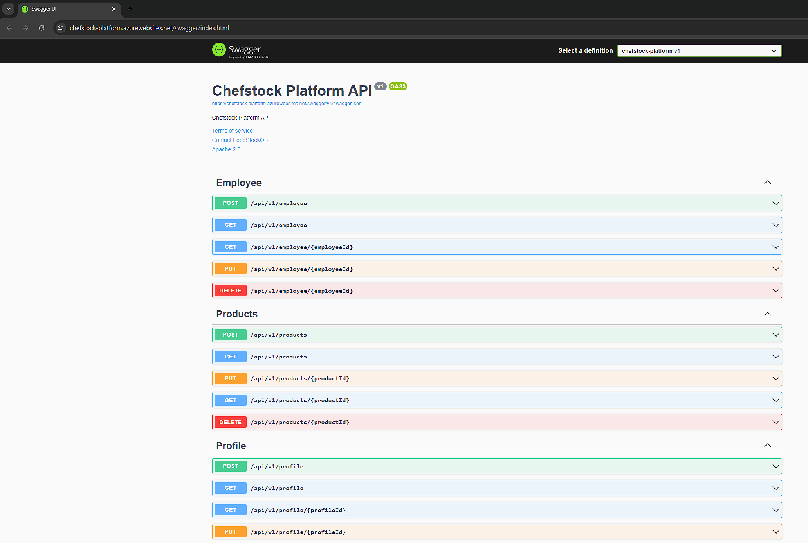

#### 5.2.4.8. Team Collaboration Insights during Sprint..
Para este sprint 4, hemos continuado con la metodología de trabajo en equipo que hemos venido utilizando en los sprints anteriores. Hemos mantenido una comunicación constante a través de reuniones semanales y el uso de herramientas de colaboración como Trello y Discord. Además, hemos seguido asignando tareas y responsabilidades a cada miembro del equipo, lo que ha permitido un progreso constante y una distribución equitativa de la carga de trabajo.

Dicha comunicación ha sido clave para el éxito de nuestro proyecto, ya que nos ha permitido abordar los desafíos y obstáculos de manera efectiva y trabajar juntos para encontrar soluciones. Además, hemos seguido compartiendo ideas y conocimientos entre nosotros, lo que ha enriquecido nuestro proceso de desarrollo y nos ha permitido aprender unos de otros.

## 5.3. Validation Interviews.

--------------------------------------------

### 5.3.1. Diseño de Entrevistas.
#### Saludo y presentación
Comenzamos con una introducción breve de los entrevistados para recordar quiénes son ya que han sido entrevistados anteriormente.

1. ¿Cómo se llama?
2. ¿Cuántos años tiene?
3. ¿En qué distrito vive?

#### Preguntas
Estas preguntas nos ayudarán a saber cuál es la experiencia de usuario, si nuestro producto llenó las expectativas del usuario, y también saber las posibles mejoras, comentarios y quejas sobre nuestro producto.

1. ¿Qué piensas de la interfaz de usuario de la aplicación web? ¿Es fácil de navegar?
2. ¿Encuentras que las funciones de la aplicación web son intuitivas y fáciles de usar?
4. ¿Hay alguna función que crees que debería estar en la aplicación web que actualmente no está?
5. ¿Cómo calificarías la experiencia general de uso de la aplicación web?
6. ¿Qué te gusta más y qué te gusta menos de la aplicación web?
7. ¿Te sentirías cómodo usando regularmente nuestra aplicación web?
8. ¿Cómo crees que nuestra aplicación web se comparan con otras similares que hayas utilizado?
9. ¿Hay algo que te confunda o te resulte difícil de entender en la aplicación web?
10. ¿Considerarías recomendarnos a tus amigos o familiares?
11. ¿Tienes alguna sugerencia para mejorar la experiencia del usuario en nuestra aplicación web?

### 5.3.2. Registro de Entrevistas.

- **Propietarios de restaurantes**
 

**Entrevista #1** 
    Nombre y apellidos: Maykol Valencia   
    Edad:  22 años  
    Distrito: Selva Alegre  
    Inicio de Entrevista: 00:00   

[URL_De_Entrevista ](https://upcedupe-my.sharepoint.com/:v:/g/personal/u202223781_upc_edu_pe/ERTdOHtIhP5Bkaq1kLiWw6UBA-UEM-kl-euejHsHk2r9yA?nav=eyJyZWZlcnJhbEluZm8iOnsicmVmZXJyYWxBcHAiOiJTdHJlYW1XZWJBcHAiLCJyZWZlcnJhbFZpZXciOiJTaGFyZURpYWxvZy1MaW5rIiwicmVmZXJyYWxBcHBQbGF0Zm9ybSI6IldlYiIsInJlZmVycmFsTW9kZSI6InZpZXcifX0%3D&e=VJeXSp)
 
[URL_De_Entrevista_YouTube](https://youtu.be/5vSirT8C68U)

Resumen de entrevista:  
Maykol Valencia, de 22 años, evaluó positivamente la aplicación web ChefStock, diseñada para la gestión de inventarios en restaurantes. Considera que la interfaz de usuario es fácil de navegar y que las funciones son intuitivas y fáciles de usar. Le gustaría que la aplicación tuviera más opciones de personalización y considera que tiene el potencial de volverse más popular si se le diera más publicidad entre los restaurantes que necesiten este tipo de servicio. En general, considera que la aplicación es útil y fácil de usar, y que le daría un uso más cotidiano por la utilidad que ofrece.

  **Entrevista #2** 

    
    Nombre y apellidos: Sebastian Samora  
    Edad:  25 años  
    Distrito: San Borja, Lima  
    Inicio de Entrevista: 16:43  
    Resumen de entrevista:  
    Sebastian Samora nos da varias recomendaciones para nuestra aplicacion. Desde la posicion de algunos botones como el diseño de la pagina, sentimos que su feedback nos ayuda mucho a poder mejorar la aplicación y cumplir con los estandares del area de logistica de los restaurantes. Por otro lado, le gusto mucho la funcionalidad de la aplicación, y en algunos momentos sonó impresionado con algunos botones y secciones de la web application. Termino contandonos que le gusto mucho la aplicacion y que para ser la fase beta, es una muy buena aplicación. 

- **Personal de restaurantes**
 

**Entrevista #1** 
    Nombre y apellidos: Carla Gutiérrez  
    Edad: 41 años  
    Distrito: San Miguel  
    Inicio de Entrevista: 4:18   
    
    URL Microsoft Stream (plataforma): https://upcedupe-my.sharepoint.com/:v:/g/personal/u20231b547_upc_edu_pe/EWBD2tUMpLVFnH9mJ4DZQuMBCph_QJezfgbLmryJywMKWQ?nav=eyJyZWZlcnJhbEluZm8iOnsicmVmZXJyYWxBcHAiOiJPbmVEcml2ZUZvckJ1c2luZXNzIiwicmVmZXJyYWxBcHBQbGF0Zm9ybSI6IldlYiIsInJlZmVycmFsTW9kZSI6InZpZXciLCJyZWZlcnJhbFZpZXciOiJNeUZpbGVzTGlua0NvcHkifX0&e=AWYAgR  
    URL Microsoft Stream (entrevista): https://upcedupe-my.sharepoint.com/:v:/g/personal/u20231b547_upc_edu_pe/EcWuUuQp57dLsYzxQDkAM6sBY7kJZFncPKyVXKOerHjcnQ?nav=eyJyZWZlcnJhbEluZm8iOnsicmVmZXJyYWxBcHAiOiJPbmVEcml2ZUZvckJ1c2luZXNzIiwicmVmZXJyYWxBcHBQbGF0Zm9ybSI6IldlYiIsInJlZmVycmFsTW9kZSI6InZpZXciLCJyZWZlcnJhbFZpZXciOiJNeUZpbGVzTGlua0NvcHkifX0&e=OtuEW9  
    Resumen de entrevista: Carla Gutiérrez, personal de un restaurante, nos comenta su opinión acerca de nuestra plataforma y su experiencia al respecto. Ella opina que la plataforma es intuitiva y fácil de navegar, ya que le permite utlizar las funciones deseadas sin muchas complicaciones. Cree que la aplicación tiene suficientes funciones para realizar el inventario y que le gustaría más opciones de personalización en el futuro. Tambien dice que le daría un uso más cotidiano a la plataforma por la utilidad que ofrece y sin mucha información que llegue a complicar al usuario. Finalmente, piensa que tiene el potencial de volverse más popular si se le diera más publicidad entre los resturantes que necesiten este tipo de servicio.  

  **Entrevista #2** 
    Nombre y apellidos: Jose Lopez Flores  
    Edad:  22 años  
    Distrito: La Molina, Lima  
    Inicio de Entrevista: 11:10  

 
    Resumen de entrevista: Jose Lopez nos ha brindado un feedback muy bueno para nuestra Web Application. Nos comentaba que le gusta mucho la aplicacion, es muy intuitiva y facil de entender y manejar. Ademas que le gusta la paleta de colores que hemos escogido. Nos comenta que esto es de mucha ayuda para personal de restaurante como él, ya que él todavia trabaja con papel y lapiz, y esto la facilitaria mucho la vida, incluyendo a sus compañeros de trabajo. Nos comenta que siempre se puede mejorar, y que nuestra aplicación esta por un muy buen inicio.  
    

5.4. Video About-the-Product.
---

- URL Microsoft Stream: https://upcedupe-my.sharepoint.com/:v:/g/personal/u202223781_upc_edu_pe/EeqJ5EI9yT9ArkA4uUodIWwBlimWARj7y8i5fMVOgVJ0LA?nav=eyJyZWZlcnJhbEluZm8iOnsicmVmZXJyYWxBcHAiOiJTdHJlYW1XZWJBcHAiLCJyZWZlcnJhbFZpZXciOiJTaGFyZURpYWxvZy1MaW5rIiwicmVmZXJyYWxBcHBQbGF0Zm9ybSI6IldlYiIsInJlZmVycmFsTW9kZSI6InZpZXcifX0%3D&e=JlA3Bd
  
- URL Youtube:  https://youtu.be/nwcbH2KVz1c
  

## Conclusiones 

---

La plataforma ChefStock ha demostrado ser una solución innovadora y eficaz para la gestión de inventarios en la industria restaurantera. Su capacidad para optimizar los recursos y reducir desperdicios ha mejorado significativamente la rentabilidad de los establecimientos que la adoptan.  

Su diseño adaptable y escalable facilita su implementación en diversos entornos gastronómicos, lo que se complementa con un excelente soporte técnico y capacitación continua. Los resultados positivos observados refuerzan la validez de la plataforma como herramienta clave para mejorar la eficiencia operativa y económica en la industria de la restauración. 

El front-end se centra en ofrecer una interfaz de usuario intuitiva y accesible, lo cual es esencial para facilitar la adopción y el uso diario por parte del personal de los restaurantes. Posee una interfaz bien diseñada que permite una navegación sencilla y una gestión de inventarios eficiente, lo que reduce la curva de aprendizaje y mejora la experiencia del usuario. 

El back-end está diseñado para gestionar eficientemente grandes volúmenes de datos de inventario en tiempo real, proporcionando escalabilidad y flexibilidad según las necesidades de cada restaurante. La arquitectura del back-end soporta desde pequeñas operaciones hasta grandes establecimientos con un alto número de elementos en el inventario. 

## Video About The Team

En este segmento, mostramos la elaboración del despegue y la conexión del backend con el frontend, además de la implementación de la landing page. Cada miembro del equipo explica su aporte en el proyecto y cómo lograron los Student Outcomes correspondientes gracias a la aplicación del proyecto.

- URL Microsoft Stream: https://upcedupe-my.sharepoint.com/:v:/g/personal/u201910146_upc_edu_pe/EbTMEwRLnaxNt6AzSQbZFMUBEzSvfw0mJGH_ghip_aUvkA?e=WhyEqi

- URL Youtube: https://youtu.be/sC_WA4icjWg

 Video About The Team Back
---
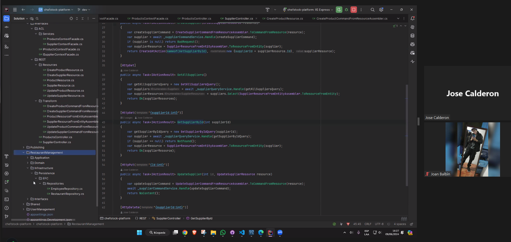

- URL Microsoft Stream: https://upcedupe-my.sharepoint.com/:v:/g/personal/u202223781_upc_edu_pe/EYISxDqyVQ9Mko00q1smHOMB54x8ZWxAOsxFCp1JhkmhPg?nav=eyJyZWZlcnJhbEluZm8iOnsicmVmZXJyYWxBcHAiOiJTdHJlYW1XZWJBcHAiLCJyZWZlcnJhbFZpZXciOiJTaGFyZURpYWxvZy1MaW5rIiwicmVmZXJyYWxBcHBQbGF0Zm9ybSI6IldlYiIsInJlZmVycmFsTW9kZSI6InZpZXcifX0%3D&e=6vZvRp
- URL Youtube: https://youtu.be/VWZ2gn-veRw

 Video Validation Sprint 4  Interviews
--
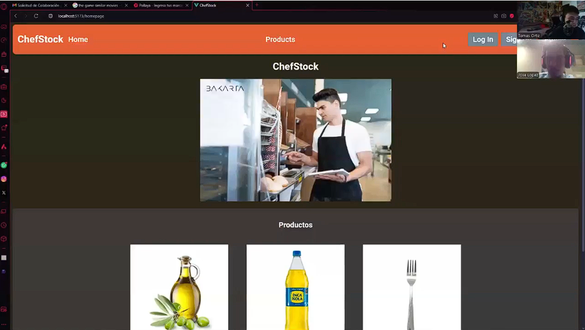

- URL Microsoft Stream: https://upcedupe-my.sharepoint.com/:v:/g/personal/u201910146_upc_edu_pe/ERwe6nnVH8ZGpHO52fl521UBh58ZNnOBZTdf3EVvSo77jg?e=fFLc2n\
- URL Youtube: 

## Bibliografía

## Anexos
Enlace para acceder a la landing page: https://chefstock-landingpage.web.app/ 

Enlace para acceder a la App ChefStock: https://front-end-chefstock.web.app/

Backend Deployment: https://chefstock-platform.azurewebsites.net/swagger/index.html

Repositorio GitHub Informe: https://github.com/FoodStockOS/ChefStock-Documentation 

Repositorio GitHub LandingPage: https://github.com/FoodStockOS/ChefStock-Landingpage 

Repositorio GitHub Frontend Web Application: https://github.com/FoodStockOS/ChefStock-Frontend 

Repositorio GitHub Backend: https://github.com/FoodStockOS/ChefStock-Backend  

Figma Web Applications Prototyping: https://www.figma.com/proto/jMEFfuUGgA39OBzRyQS87O/Web-Applications-Mock-ups?type=design&node-id=1-2&t=bhfHoLW7QX0Ohvg7-1&scaling=contain&page-id=0%3A1&starting-point-node-id=1%3A2&mode=design 

Video About-the-Product: https://youtu.be/nwcbH2KVz1c

Video About The Team BackEnd: https://youtu.be/VWZ2gn-veRw

Video About Deployment Evidence for Sprint Review: https://upcedupe-my.sharepoint.com/:v:/g/personal/u202223781_upc_edu_pe/EaHNabPjoVFKlPi-JtLEvZcBsNqauo1SQ0jRnyCBB0fhkA?nav=eyJyZWZlcnJhbEluZm8iOnsicmVmZXJyYWxBcHAiOiJTdHJlYW1XZWJBcHAiLCJyZWZlcnJhbFZpZXciOiJTaGFyZURpYWxvZy1MaW5rIiwicmVmZXJyYWxBcHBQbGF0Zm9ybSI6IldlYiIsInJlZmVycmFsTW9kZSI6InZpZXcifX0%3D&e=F3Yewv

Video About The Team Participants: https://upcedupe-my.sharepoint.com/:v:/g/personal/u201910146_upc_edu_pe/EbTMEwRLnaxNt6AzSQbZFMUBEzSvfw0mJGH_ghip_aUvkA?e=WhyEqi

Video Validation Sprint 4 Interviews: https://upcedupe-my.sharepoint.com/:v:/g/personal/u201910146_upc_edu_pe/ERwe6nnVH8ZGpHO52fl521UBh58ZNnOBZTdf3EVvSo77jg?e=fFLc2n

