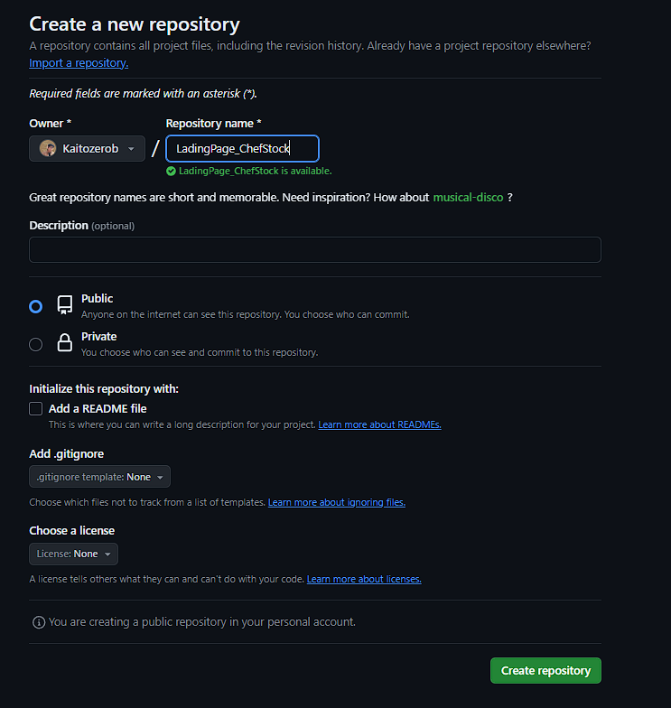
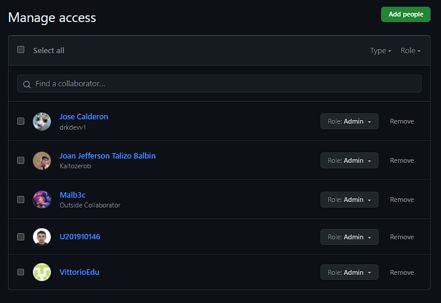
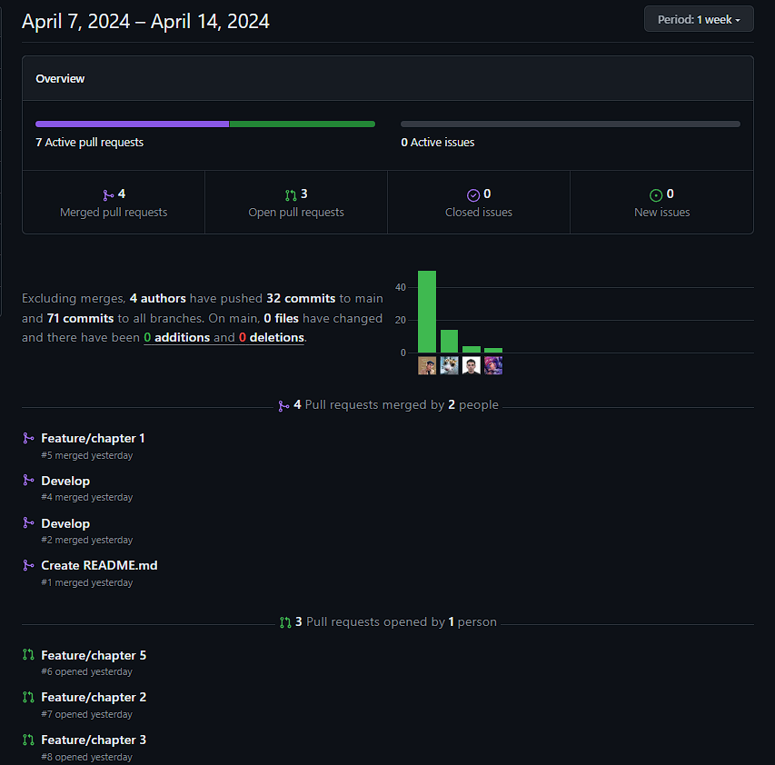
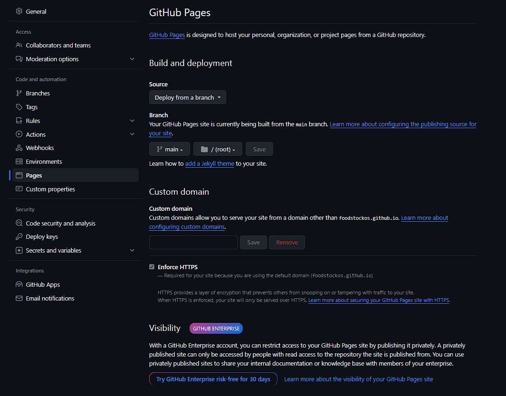

# **Capítulo V: Product Implementation, Validation & Deployment.
## 5.1. Software Configuration Management.
### 5.1.1. Software Development Environment Configuration.
- ### Proyect Management:
  * ### Whatsapp:
  
    
  
    * Una Esta es una plataforma de mensajería instantánea que funciona con sistemas operativos Android e iOS, y ha sido desarrollada por Meta. También ofrece una versión web que puede ser utilizada desde cualquier navegador. 
        [Link De Descarga](https://www.whatsapp.com/download//?l=uz&lang=es)
       
  * ### Discord:
    
    * Plataforma diseñada para facilitar la coordinación y realización de reuniones internas de manera semanal.   
      [Link De Descarga](https://discord.com/download)
    
  * ### Trello:
  
    * Aplicación destinada a la gestión de proyectos, que permite un seguimiento eficiente de las tareas asignadas a cada integrante del equipo.  
    [Link De Registro o Inicio De Sesión](https://trello.com/es)

- ### Requirement Management:

  * ### Miro:
    
    * Ofrece una variedad de plantillas para apoyar en la planificación y gestión de proyectos.  
      [Link De Registro o Inicio De Sesión](https://miro.com/es/login/)
  
  * ### UXPressia:
    
    * Herramienta online que permite el mapeo y análisis de las necesidades del cliente en proyectos específicos. 
      [Link De Registro o Inicio De Sesión](https://uxpressia.com)
  
  * ### Structurizr:
    
    * Suite de herramientas que facilita la creación colaborativa de modelos C4 para la representación gráfica de productos. 
      [Link De Registro o Inicio De Sesión](https://structurizr.com)
  
  * ### Vertabelo:
    
    * Plataforma colaborativa que permite diseñar de manera conjunta diagramas de bases de datos.  
      [Link De Registro o Inicio De Sesión](https://vertabelo.com)
      

- ###  Product UX/UI Design:
  * ### Figma:
  
    * Herramienta colaborativa útil para el desarrollo de wireframes y mockups.   
      [Link De Registro,Inicio De Sesión y Descarga](https://www.figma.com/downloads/)
    * ### LucidChart:
  
    * Permite la creación colaborativa de flujos de wireframes y mockups.   
    [Link De Registro o Inicio De Sesión ](https://www.lucidchart.com/pages/es)
  
- ###  Software Development:
* ### HTML5:
    

  *  Lenguaje de marcado empleado para estructurar páginas web, incluyendo elementos como texto, imágenes y videos. 
    [Informacion Relacionada](https://www.esic.edu/rethink/tecnologia/html5-que-es-caracteristicas-y-como-funciona-c#:~:text=El%20HTML5%20es%20un%20estándar,%2C%20estilo%20de%20letra%2C%20etc.)
  
  * ### CSS:
  
  
  * Lenguaje de diseño gráfico que se usa para formatear y estilizar documentos HTML.   
    [Informacion Relacionada](https://developer.mozilla.org/es/docs/Web/CSS)
  
  * ### JavaScript:
  
  * Lenguaje de programación dinámico orientado a objetos, utilizado para añadir interactividad a las páginas web.  
    [Informacion Relacionada]( https://developer.mozilla.org/es/docs/Web/JavaScript )
  
  * ### WebStorm:

  

  * Entorno de desarrollo integrado (IDE) especializado en JavaScript.  
    [Link De Descarga]( https://www.jetbrains.com/es-es/webstorm/)

- ###  Software Testing:
    * ### Lenguaje Gherkin:
    *  Lenguaje Específico de Dominio (DSL), diseñado para escribir pruebas de aceptación de una forma que sea comprensible para todos los participantes del proyecto.   
- ###  Software Documentation:
    * ### Github:
    * Plataforma de alojamiento para la gestión de código fuente, que facilita la colaboración entre desarrolladores.  
      [Link De Descarga]( https://desktop.github.com)
      [Link De Registro o Inicio De Sesión](https://github.com/login)
  

- ###  Software Deployment:
    * ### Github Pages:
    *  Permite realizar despliegues directos de sitios web desde un repositorio de GitHub.

### 5.1.2. Source Code Management.

Landing Page Repository: [Landing Page Repository]()
- #### GitFlow Implementation:
  * Para adoptar el modelo de ramificación Gitflow en nuestro manejo de versiones con Git, nos hemos guiado por el artículo "A successful Git branching model" de Vincent Driessen. Este recurso ha sido esencial para definir las convenciones específicas que implementaremos en nuestro proyecto.

- ### **Master o Main branch**
   * Rama Principal, Master o Main branch,contiene el código que actualmente está en producción. Se la conoce como la Master branch o Main branch.

  * #### Notación: master o main

- ### **Develop branch**
  * Rama de Desarrollo, Develop branch, en la rama Develop se acumulan las últimas actualizaciones y cambios que se incorporarán en la próxima versión. Funciona como un entorno de integración y prueba continua antes de que los cambios se fusionen con la rama principal para el despliegue en producción.
  * #### Notación: develop

- ### **Release branch**
  * La rama de lanzamiento, Release branch, facilitará la preparación de una nueva versión del producto. Esta rama permitirá la corrección de errores y permitirá que la rama Develop reciba más actualizaciones.
  
     Debe derivarse de la rama Develop.
     Debe fusionarse con la rama Develop y Master.
  * #### Notación: release

- ### **Feature branch**
  * Rama de Características (Feature branch): Las Feature branches se utilizan para desarrollar nuevas funcionalidades que se incluirán en la siguiente versión o futuras iteraciones. Estas ramas deben originarse desde Develop y eventualmente fusionarse de vuelta a Develop.
  
     Debe derivarse de la rama Develop.
     Debe fusionarse de vuelta a la rama Develop.
  * #### Notación: release

- ### **Hotfix branch**
  * Rama de Corrección Rápida (Hotfix branch): Utilizada para abordar errores críticos en la versión de producción, la Hotfix branch permite la rápida implementación de soluciones mientras el equipo sigue trabajando en otras mejoras. Debe originarse desde Master y fusionarse tanto con Develop como con Master.
    
     Debe derivarse de la rama Master
     Debe fusionarse con la rama Develop y Master
  * #### Notación: hotfix

- ### **Conventional Commits**
  * Compromisos Convencionales (Conventional Commits): Es una metodología para estructurar los mensajes de confirmación de cambios en un formato estándar y semántico. Facilita la comunicación de modificaciones y ayuda en la automatización de registros de cambios. El formato típico incluye un encabezado, un cuerpo opcional y un pie de página opcional, y ayuda a describir claramente los cambios para un seguimiento y comprensión efectivos por parte del equipo. 
La estructura de un commit debe seguir las siguientes pautas:
~~~
git commit -m “<type>[optional scope]: <title>“ -m “<description”
~~~
**Tipos De Conventional Commits**
~~~
1. **feat**: Se usa para describir una nueva característica o funcionalidad añadida al código.
2. **fix**: Indica una corrección de errores o solución a un problema.
3. **docs**: Se emplea para cambios o mejoras en la documentación del código.
4. **style**: Describe cambios relacionados con el formato del código, como espacios en blanco, sangrías, etc., que no afectan su funcionalidad.
5. **refactor**: Se utiliza para modificaciones en el código que no corrigen errores ni añaden nuevas funcionalidades, sino que mejoran su estructura o legibilidad.
6. **test**: Indica la adición o modificación de pruebas unitarias o funcionales.
7. **chore**: Se usa para cambios en el proceso de construcción o tareas de mantenimiento que no están directamente relacionadas con el código en sí.
8. **perf**: Describe mejoras de rendimiento en el código.
~~~

### 5.1.3. Source Code Style Guide & Conventions.

Como norma general, se espera que el código escrito por los miembros del equipo esté en inglés.
- ### HTML
  - #### Use Lowercase Element Names:
    Es aconsejable usar minúsculas para los nombres de los elementos HTML.
      ~~~ 
    <body>
          
Esto es un párrafo

    <body>
     ~~~
  - #### Close All HTML Elements:
    Es importante asegurarse de cerrar correctamente todos los elementos HTML.
      ~~~ 
    <body>
          
Esto es un párrafo

          
Esto es otro párrafo

    <body>
     ~~~
    

  - #### Use Lowercase Attribute Names:
    Se recomienda usar minúsculas para los nombres de los atributos en HTML.
    ~~~ 
    <a href="https://www.w3schools.com/html/">Visit our HTMLtutorial</a>
     ~~~
    

  - #### Always Specify alt, width, and height for Images:
    Es prudente usar estas especificaciones para mejorar la accesibilidad en caso de que la imagen no se muestre.
    ~~~ 
    
    ~~~ 
  - #### Spaces and Equal Signs:
    Se sugiere evitar espacios entre el nombre del atributo, el signo igual y el valor para mejorar la legibilidad.
    ~~~ 
    <link rel="stylesheet" href="styles.css">
    ~~~ 
- ### CSS
  - #### ID and Class Naming
    Se deben usar nombres significativos que expresen claramente la función del elemento.
    ~~~ 
    #gallery {}
    #login {}
    .video {}
     ~~~
  - #### ID and Class Name Style
    Prefiera nombres cortos pero descriptivos para facilitar la comprensión de su propósito.
    ~~~ 
    #nav {}
    .author {}
    ~~~
  - #### Shorthand Properties
    Se aconseja usar propiedades CSS en forma abreviada para aumentar la eficiencia y comprensibilidad del código.
     ~~~ 
     border-top: 0;
     font: 100%/1.6 palatino, georgia, serif;
     padding: 0 1em 2em;
     ~~~ 
  - #### 0 and Units
    Se recomienda omitir la unidad después de un valor cero para optimizar el tamaño y la legibilidad del código.
     ~~~ 
     margin: 0;
     padding: 0;
     ~~~
  - #### Declaration Order
    Se sugiere ordenar las declaraciones alfabéticamente para mejorar el mantenimiento y recordación del código.
    ~~~ 
     background: fuchsia;
     border: 1px solid;
     border-radius: 4px;
     color: black;
     text-align: center;
     text-indent: 2em;
    ~~~  
- ### JAVASCRIPT
  - #### Use expanded syntax
    Se recomienda escribir cada declaración en una nueva línea, con las llaves abriendo en la misma línea de la declaración y cerrando en una nueva línea al final.
    ~~~ 
    function myFunc() {
     console.log('Hello!');
    };
    ~~~
  - #### Variable naming
    Utilizar lowerCamelCase para el nombre de las variables.
    ~~~ 
    let playerScore = 0;
    let speed = distance / time;
    ~~~  
  - #### Declaring variables
    Se prefiere el uso de let y const sobre var.
    ~~~ 
    const myName = 'Chris';
    console.log(myName);
    let myAge = '40';
    myAge++;
    console.log('Happy birthday!');
    ~~~ 
  - #### Function naming
    Usar lowerCamelCase y empezar con un verbo que describa la acción de la función.
    ~~~ 
    function sayHello() {
    alert('Hello!');
    };
    ~~~

### 5.1.4. Software Deployment Configuration.

- Creacion Landing Page: 
1. Se crea un repositorio remoto en GitHub

   

2. Agregar a participantes

3. Habilitmos Gitgub Pages en branch "master" y ruta "/(root)"
   

## 5.2. Landing Page, Services & Applications Implementation.

### 5.2.1. Sprint 1 
Durante el primer sprint, nos enfocaremos en la creación de la Landing Page, dividiendo equitativamente las tareas identificadas entre los miembros del equipo para garantizar un avance fluido y eficiente en el desarrollo. 
#### 5.2.1.1 Sprint Planning 1
<table>
    <thead>
        <tr>
            <th colspan="">Sprint #</th>
            <th>1</th>
        </tr>
    </thead>
    <tbody>
        <tr>
            <th colspan="2">Sprint Planning Background</th>
        </tr>
        <tr>
            <th>Date</th>
            <td>2024/04/1</td>
        </tr>
        <tr>
            <th>Time</th>
            <td>17:00 pm</td>
        </tr>
        <tr>
            <th>Location</th>
            <td>Sala de reuniones virtual (Discord)</td>
        </tr>
        <tr>
            <th>Prepared By</th>
            <td>Tomás Ortiz Fajardo</td>
        </tr>
        <tr>
            <th>Attendees (to planning meeting)</th>
            <td>Joan Talizo Balbin, Jose Calderon, Adrian Quiroz Caceres, Vittorio Eduardo Espinoza, Tomás Ortiz Fajardo</td>
        </tr>
        <tr>
            <th>Sprint 1 Review Summary</th>
            <td>Es la primera reunión donde se evaluarán los puntos que se harán por funciones. </td>
        </tr>
        <tr>
            <th>Sprint Planning Background</th>
            <td>Se acordó que durante este sprint se centrarán en la creación de la Landing Page y se dividirán equitativamente las tareas identificadas entre los miembros del equipo.</td>
        </tr>
        <tr>
            <th colspan="2">Sprint Goal & User Stories</th>
        </tr>
        <tr>
            <th>Sprint 1 Goal</th>
            <td>Durante este sprint, el objetivo principal es crear la Landing Page para el proyecto. Esto incluye diseñar y desarrollar una página de aterrizaje atractiva y funcional que cumpla con los requisitos del proyecto. Se asignarán las User Stories relacionadas con la creación de la Landing Page a los miembros del equipo, y el sprint se considerará exitoso si todas estas historias de usuario están implementadas y funcionando correctamente al finalizar el sprint.</td>
        </tr>
        <tr>
            <th>Sprint 1 Velocity</th>
            <td>Se establece un Velocity de 20 Story Points para este Sprint.</td>
        </tr>
        <tr>
            <th>Sum of Story Points</th>
            <td>15 Story Points</td>
        </tr>
    </tbody>
</table>

#### 5.2.1.2 Sprint  Backlogs 
<table>
    <thead>
        <tr>
            <th>Sprint #</th>
            <th colspan="7">Sprint 1</th>
        </tr>
        <tr>
            <th>User Story</th>
            <th colspan="7">Work-Item/Task</th>
        </tr>
        <tr>
            <th>Id</th>
            <th>Title</th>
            <th>Id</th>
            <th>Title</th>
            <th>Description</th>
            <th>Estimación (Horas)</th>
            <th>Assigned To</th>
            <th>Status (to-do/In-process/To-Review/Done)</th>
        </tr>
    </thead>
    <tbody>
        <tr>
            <td>HU-01</td>
            <td>Barra de navegación clara </td>
            <td>1</td>
            <td>Diseñar la estructura de la barra de navegación  </td>
            <td>Crear el diseño visual de la barra de navegación para garantizar la claridad y funcionalidad.  </td>
            <td>3</td>
            <td></td>
            <td>To-Review</td>
        </tr>
        <tr>
            <td>HU-02</td>
            <td>Visualizar la sección "Quiénes Somos?"</td>
            <td>1</td>
            <td>Crear contenido para la sección "Quiénes Somos?"</td>
            <td>Redactar la historia, misión y visión de la empresa para mostrar en la sección "Quiénes Somos?".</td>
            <td>3</td>
            <td></td>
            <td>To-Review</td>
        </tr>
        <tr>
            <td>HU-03</td>
            <td>Desarrollar el diseño de la sección "Servicios</td>
            <td>1</td>
            <td>Desarrollar el diseño de la sección "Servicios"</td>
            <td>Diseñar visualmente la sección "Servicios" para mostrar los servicios ofrecidos por la empresa.</td>
            <td>4</td>
            <td></td>
            <td>To-Review</td>
        </tr>
        <tr>
            <td>HU-04</td>
            <td>Visualizar información sobre el Sección Equipo de Trabajo</td>
            <td>1</td>
            <td>Recopilar información del equipo  </td>
            <td>Recopilar fotos, roles y descripciones de los miembros del equipo para mostrar en la sección "Equipo de Trabajo".</td>
            <td>2</td>
            <td></td>
            <td>To-Review</td>
        </tr>
    </tbody>
</table>

#### 5.2.1.3 Development Evidence for Sprint Review
<table>
    <thead>
        <tr>
            <th>Repository</th>
            <th>Branch</th>
            <th>Commit ID</th>
            <th>Commit Message</th>
            <th>Commit Message Body</th>
            <th>Commited on (Date)</th>
        </tr>
    </thead>
    <tbody>
        <tr>
            <td>FoodStockOS/ChefStock</td>
            <td></td>
            <td></td>
            <td></td>
            <td></td>
            <td></td>
        </tr>
        <tr>
            <td>FoodStockOS/ChefStock</td>
            <td></td>
            <td></td>
            <td></td>
            <td></td>
            <td></td>
        </tr>
        <tr>
            <td>FoodStockOS/ChefStock</td>
            <td></td>
            <td></td>
            <td></td>
            <td></td>
            <td></td>
        </tr>
        <tr>
            <td>FoodStockOS/ChefStock</td>
            <td></td>
            <td></td>
            <td></td>
            <td></td>
            <td></td>
        </tr>
    </tbody>
</table>

#### 5.2.1.4 Testing Suite Evidence for Sprint Review
Durante este sprint, llevamos a cabo las funcionalidades definidas en nuestro Sprint Backlog, asegurándonos de incluir sus criterios de aceptación correspondientes.\

#### 5.2.1.5 Execution Evidence for Sprint Review
Durante el primer sprint, el equipo de desarrollo de la startup FoodStockOS logró completar la creación de la Landing Page para nuestro proyecto ChefStock. En nuestra página web, los usuarios podrán acceder a detalles sobre...
#### 5.2.1.6 Services Documentation Evidence for Sprint Review
Hasta ahora, no disponemos de documentación de nuestros servicios, ya que este primer sprint se ha centrado en el desarrollo de la Landing Page.
#### 5.2.1.7 Software Deployment Evidence for Sprint Review
Para implementar la Landing Page, inicialmente creamos el repositorio en Github junto con las ramas necesarias main, developer y features.\
\
\
Luego, cada integrante sube su parte del proyecto 

Finalmente, desplegamos el proyecto en la rama main utilizando la herramienta GitHub Pages.

#### 5.2.1.8 Team Collaboration Insights during Sprint
Durante el transcurso del primer sprint, todos los miembros del equipo de FoodStockOS participamos activamente y de forma constante en la ejecución de las tareas asignadas. 

Presentamos pruebas del progreso individual:

 

## Conclusiones 

#Bibliografía
